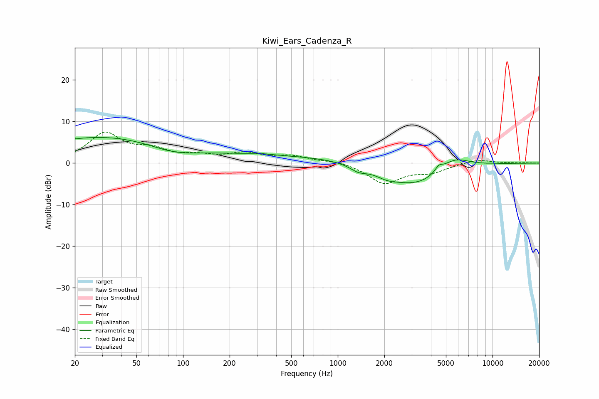

# Kiwi_Ears_Cadenza_R
See [usage instructions](https://github.com/jaakkopasanen/AutoEq#usage) for more options and info.

### Parametric EQs
Apply preamp of -6.3 dB when using parametric equalizer.

|   # | Type    |   Fc (Hz) |    Q |   Gain (dB) |
|-----|---------|-----------|------|-------------|
|   1 | Peaking |        31 | 0.31 |         6.4 |
|   2 | Peaking |        87 | 0.82 |        -2.3 |
|   3 | Peaking |       308 | 2.13 |         0.3 |
|   4 | Peaking |       336 | 0.23 |         1.8 |
|   5 | Peaking |      1360 | 2.51 |        -1.5 |
|   6 | Peaking |      2082 | 1.85 |        -1.5 |
|   7 | Peaking |      3260 | 0.78 |        -5.3 |
|   8 | Peaking |      4494 | 5.83 |         1.3 |
|   9 | Peaking |      5602 | 1.37 |         3.2 |
|  10 | Peaking |     10000 | 4.43 |         0.1 |

### Fixed Band EQs
When using fixed band (also called graphic) equalizer, apply preamp of **-7.6 dB** (if available) and set gains manually with these parameters.

|   # | Type    |   Fc (Hz) |    Q |   Gain (dB) |
|-----|---------|-----------|------|-------------|
|   1 | Peaking |        31 | 1.41 |         6.9 |
|   2 | Peaking |        62 | 1.41 |         2.7 |
|   3 | Peaking |       125 | 1.41 |         1.3 |
|   4 | Peaking |       250 | 1.41 |         2.1 |
|   5 | Peaking |       500 | 1.41 |         1.5 |
|   6 | Peaking |      1000 | 1.41 |         0.6 |
|   7 | Peaking |      2000 | 1.41 |        -4.8 |
|   8 | Peaking |      4000 | 1.41 |        -1.9 |
|   9 | Peaking |      8000 | 1.41 |         1   |
|  10 | Peaking |     16000 | 1.41 |         0.1 |

### Graphs

