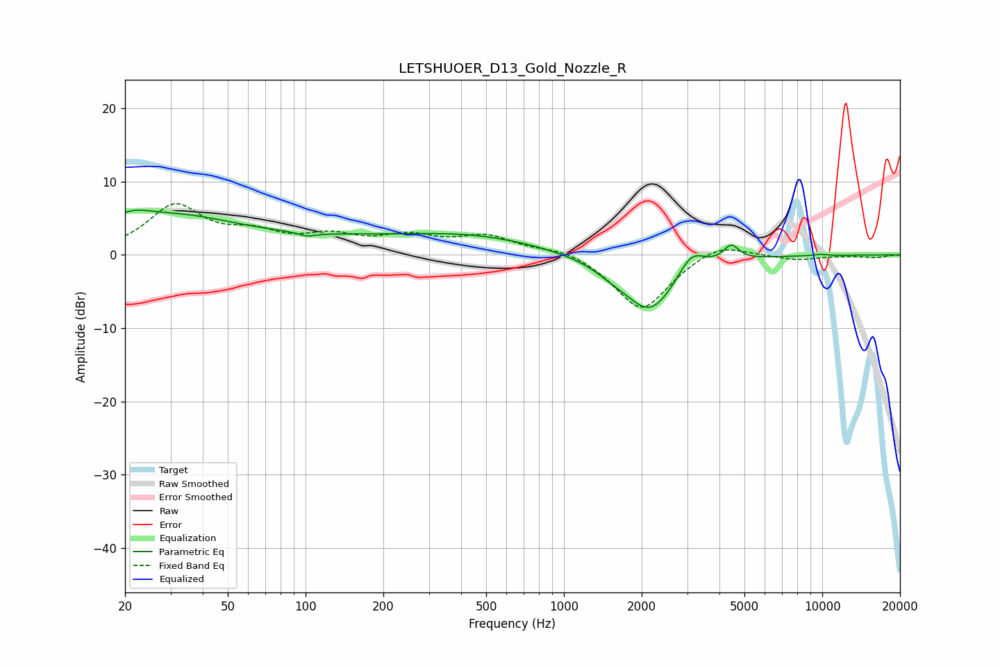

# LETSHUOER_D13_Gold_Nozzle_R
See [usage instructions](https://github.com/jaakkopasanen/AutoEq#usage) for more options and info.

### Parametric EQs
Apply preamp of -6.2 dB when using parametric equalizer.

|   # | Type    |   Fc (Hz) |    Q |   Gain (dB) |
|-----|---------|-----------|------|-------------|
|   1 | Peaking |        21 | 1.54 |         2.7 |
|   2 | Peaking |        33 | 0.67 |         3.4 |
|   3 | Peaking |       101 | 4.05 |        -0.5 |
|   4 | Peaking |       125 | 0.22 |         2.2 |
|   5 | Peaking |       483 | 0.55 |         1.4 |
|   6 | Peaking |      1534 | 2.06 |        -0.8 |
|   7 | Peaking |      2155 | 1.36 |        -7.8 |
|   8 | Peaking |      3116 | 2.78 |         3.1 |
|   9 | Peaking |      4441 | 4.79 |         2.1 |
|  10 | Peaking |      9794 | 5.4  |         0.2 |

### Fixed Band EQs
When using fixed band (also called graphic) equalizer, apply preamp of **-7.1 dB** (if available) and set gains manually with these parameters.

|   # | Type    |   Fc (Hz) |    Q |   Gain (dB) |
|-----|---------|-----------|------|-------------|
|   1 | Peaking |        31 | 1.41 |         6.5 |
|   2 | Peaking |        62 | 1.41 |         2.3 |
|   3 | Peaking |       125 | 1.41 |         2.1 |
|   4 | Peaking |       250 | 1.41 |         2.2 |
|   5 | Peaking |       500 | 1.41 |         2.4 |
|   6 | Peaking |      1000 | 1.41 |         1   |
|   7 | Peaking |      2000 | 1.41 |        -7.7 |
|   8 | Peaking |      4000 | 1.41 |         2   |
|   9 | Peaking |      8000 | 1.41 |        -0.7 |
|  10 | Peaking |     16000 | 1.41 |        -0.3 |

### Graphs

