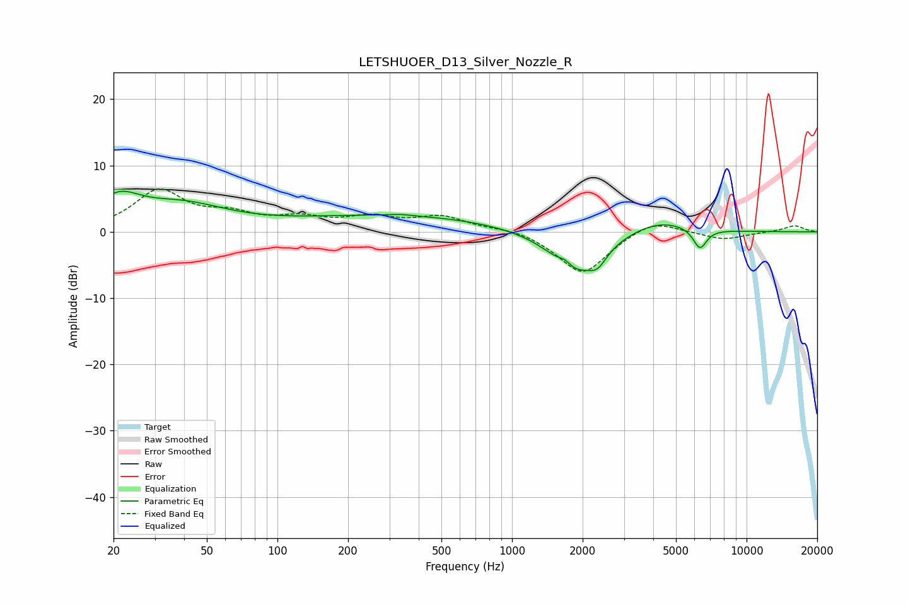

# LETSHUOER_D13_Silver_Nozzle_R
See [usage instructions](https://github.com/jaakkopasanen/AutoEq#usage) for more options and info.

### Parametric EQs
Apply preamp of -6.2 dB when using parametric equalizer.

|   # | Type    |   Fc (Hz) |    Q |   Gain (dB) |
|-----|---------|-----------|------|-------------|
|   1 | Peaking |        21 | 1.51 |         4.1 |
|   2 | Peaking |        39 | 0.74 |         3.5 |
|   3 | Peaking |       244 | 0.27 |         1.2 |
|   4 | Peaking |       333 | 3.2  |         0.2 |
|   5 | Peaking |       376 | 0.36 |         1.3 |
|   6 | Peaking |      1682 | 5.21 |         1   |
|   7 | Peaking |      1843 | 1.34 |        -6.2 |
|   8 | Peaking |      2317 | 3.53 |        -2.2 |
|   9 | Peaking |      4265 | 1.09 |         2   |
|  10 | Peaking |      6328 | 4.78 |        -3.1 |

### Fixed Band EQs
When using fixed band (also called graphic) equalizer, apply preamp of **-6.6 dB** (if available) and set gains manually with these parameters.

|   # | Type    |   Fc (Hz) |    Q |   Gain (dB) |
|-----|---------|-----------|------|-------------|
|   1 | Peaking |        31 | 1.41 |         6   |
|   2 | Peaking |        62 | 1.41 |         2.1 |
|   3 | Peaking |       125 | 1.41 |         1.7 |
|   4 | Peaking |       250 | 1.41 |         1.9 |
|   5 | Peaking |       500 | 1.41 |         2.1 |
|   6 | Peaking |      1000 | 1.41 |         0.6 |
|   7 | Peaking |      2000 | 1.41 |        -6.5 |
|   8 | Peaking |      4000 | 1.41 |         2.1 |
|   9 | Peaking |      8000 | 1.41 |        -1.2 |
|  10 | Peaking |     16000 | 1.41 |         1   |

### Graphs

