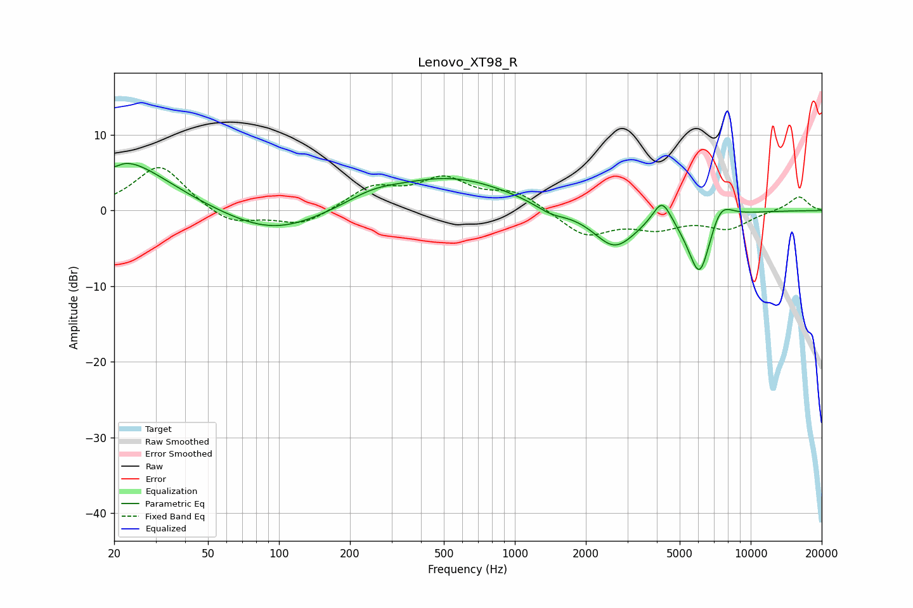

# Lenovo_XT98_R
See [usage instructions](https://github.com/jaakkopasanen/AutoEq#usage) for more options and info.

### Parametric EQs
Apply preamp of -6.3 dB when using parametric equalizer.

|   # | Type    |   Fc (Hz) |    Q |   Gain (dB) |
|-----|---------|-----------|------|-------------|
|   1 | Peaking |        20 | 5.56 |        -0.7 |
|   2 | Peaking |        21 | 0.72 |         6.9 |
|   3 | Peaking |        94 | 0.68 |        -3.3 |
|   4 | Peaking |       249 | 1.19 |         1.4 |
|   5 | Peaking |       535 | 0.55 |         4.3 |
|   6 | Peaking |      1417 | 2.1  |        -1.1 |
|   7 | Peaking |      2647 | 1.52 |        -4.9 |
|   8 | Peaking |      4209 | 3.55 |         3.4 |
|   9 | Peaking |      6074 | 2.7  |        -8.9 |
|  10 | Peaking |      7416 | 2.66 |         3.1 |

### Fixed Band EQs
When using fixed band (also called graphic) equalizer, apply preamp of **-5.8 dB** (if available) and set gains manually with these parameters.

|   # | Type    |   Fc (Hz) |    Q |   Gain (dB) |
|-----|---------|-----------|------|-------------|
|   1 | Peaking |        31 | 1.41 |         6.1 |
|   2 | Peaking |        62 | 1.41 |        -2.1 |
|   3 | Peaking |       125 | 1.41 |        -2   |
|   4 | Peaking |       250 | 1.41 |         2.9 |
|   5 | Peaking |       500 | 1.41 |         3.8 |
|   6 | Peaking |      1000 | 1.41 |         2.3 |
|   7 | Peaking |      2000 | 1.41 |        -3.3 |
|   8 | Peaking |      4000 | 1.41 |        -2   |
|   9 | Peaking |      8000 | 1.41 |        -2.2 |
|  10 | Peaking |     16000 | 1.41 |         1.9 |

### Graphs

