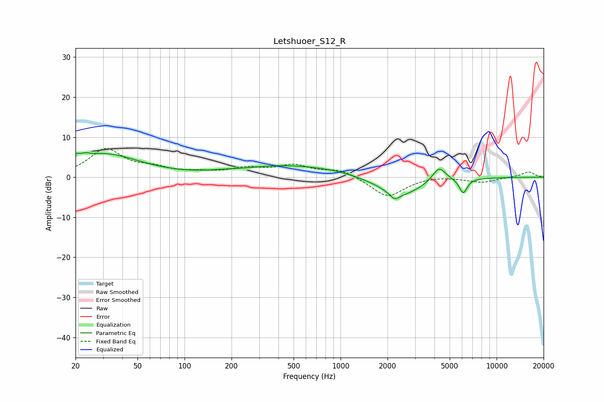

# Letshuoer_S12_R
See [usage instructions](https://github.com/jaakkopasanen/AutoEq#usage) for more options and info.

### Parametric EQs
Apply preamp of -6.2 dB when using parametric equalizer.

|   # | Type    |   Fc (Hz) |    Q |   Gain (dB) |
|-----|---------|-----------|------|-------------|
|   1 | Peaking |        20 | 5.55 |         1.3 |
|   2 | Peaking |        23 | 5.45 |         0.7 |
|   3 | Peaking |        30 | 0.63 |         5.7 |
|   4 | Peaking |       174 | 1.27 |         0.3 |
|   5 | Peaking |       430 | 0.52 |         2.6 |
|   6 | Peaking |       932 | 0.85 |         0.8 |
|   7 | Peaking |      2218 | 4.7  |        -1.6 |
|   8 | Peaking |      2430 | 1    |        -4.6 |
|   9 | Peaking |      4275 | 3.17 |         3.8 |
|  10 | Peaking |      6108 | 5.47 |        -3.7 |

### Fixed Band EQs
When using fixed band (also called graphic) equalizer, apply preamp of **-7.3 dB** (if available) and set gains manually with these parameters.

|   # | Type    |   Fc (Hz) |    Q |   Gain (dB) |
|-----|---------|-----------|------|-------------|
|   1 | Peaking |        31 | 1.41 |         6.8 |
|   2 | Peaking |        62 | 1.41 |         1.8 |
|   3 | Peaking |       125 | 1.41 |         0.9 |
|   4 | Peaking |       250 | 1.41 |         1.9 |
|   5 | Peaking |       500 | 1.41 |         2.7 |
|   6 | Peaking |      1000 | 1.41 |         1.9 |
|   7 | Peaking |      2000 | 1.41 |        -5   |
|   8 | Peaking |      4000 | 1.41 |         0.4 |
|   9 | Peaking |      8000 | 1.41 |        -1.3 |
|  10 | Peaking |     16000 | 1.41 |         1.4 |

### Graphs

