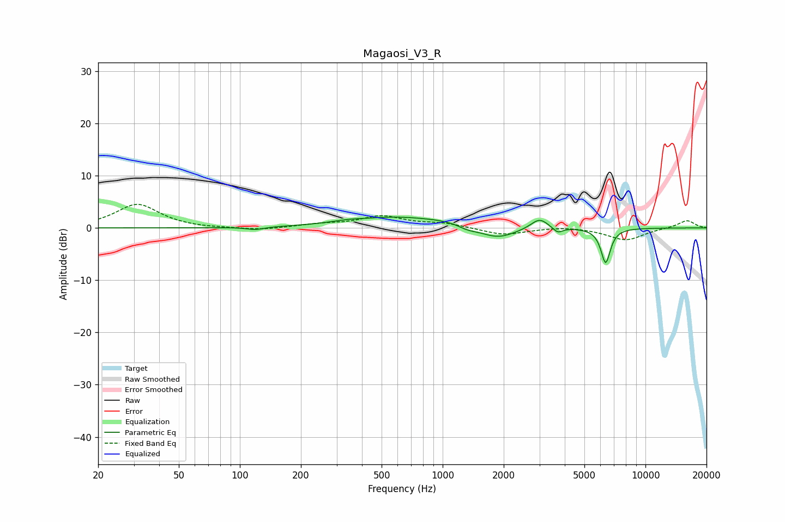

# Magaosi_V3_R
See [usage instructions](https://github.com/jaakkopasanen/AutoEq#usage) for more options and info.

### Parametric EQs
Apply preamp of -2.2 dB when using parametric equalizer.

|   # | Type    |   Fc (Hz) |    Q |   Gain (dB) |
|-----|---------|-----------|------|-------------|
|   1 | Peaking |       119 | 3.26 |        -0.5 |
|   2 | Peaking |       335 | 2.11 |         0.3 |
|   3 | Peaking |       595 | 0.6  |         2.1 |
|   4 | Peaking |      1040 | 1.58 |         0.4 |
|   5 | Peaking |      1322 | 3.42 |        -0.5 |
|   6 | Peaking |      1510 | 1.57 |        -0.2 |
|   7 | Peaking |      1882 | 1.63 |        -2.1 |
|   8 | Peaking |      3003 | 3.34 |         2   |
|   9 | Peaking |      3693 | 6    |        -1.1 |
|  10 | Peaking |      6364 | 5.89 |        -6.7 |

### Fixed Band EQs
When using fixed band (also called graphic) equalizer, apply preamp of **-4.6 dB** (if available) and set gains manually with these parameters.

|   # | Type    |   Fc (Hz) |    Q |   Gain (dB) |
|-----|---------|-----------|------|-------------|
|   1 | Peaking |        31 | 1.41 |         4.5 |
|   2 | Peaking |        62 | 1.41 |        -0.1 |
|   3 | Peaking |       125 | 1.41 |        -0.5 |
|   4 | Peaking |       250 | 1.41 |         0.6 |
|   5 | Peaking |       500 | 1.41 |         2.1 |
|   6 | Peaking |      1000 | 1.41 |         0.8 |
|   7 | Peaking |      2000 | 1.41 |        -1.4 |
|   8 | Peaking |      4000 | 1.41 |         0.4 |
|   9 | Peaking |      8000 | 1.41 |        -2.3 |
|  10 | Peaking |     16000 | 1.41 |         1.5 |

### Graphs

