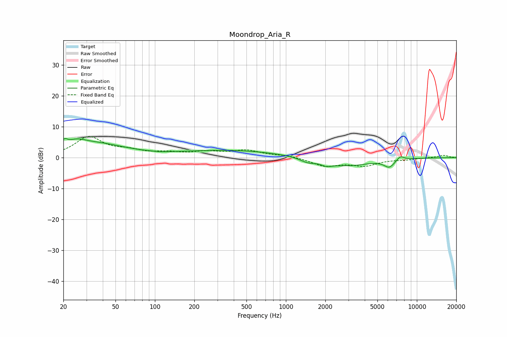

# Moondrop_Aria_R
See [usage instructions](https://github.com/jaakkopasanen/AutoEq#usage) for more options and info.

### Parametric EQs
Apply preamp of -6.3 dB when using parametric equalizer.

|   # | Type    |   Fc (Hz) |    Q |   Gain (dB) |
|-----|---------|-----------|------|-------------|
|   1 | Peaking |        20 | 5.83 |         2   |
|   2 | Peaking |        25 | 2.1  |         2   |
|   3 | Peaking |        35 | 0.61 |         4.3 |
|   4 | Peaking |       110 | 2.55 |        -0.2 |
|   5 | Peaking |       379 | 0.36 |         2.3 |
|   6 | Peaking |      1467 | 2.49 |        -1.3 |
|   7 | Peaking |      2043 | 3.65 |        -1.1 |
|   8 | Peaking |      2894 | 0.8  |        -2.7 |
|   9 | Peaking |      6161 | 3.36 |        -2.5 |
|  10 | Peaking |      7473 | 4.77 |         1.4 |

### Fixed Band EQs
When using fixed band (also called graphic) equalizer, apply preamp of **-7.0 dB** (if available) and set gains manually with these parameters.

|   # | Type    |   Fc (Hz) |    Q |   Gain (dB) |
|-----|---------|-----------|------|-------------|
|   1 | Peaking |        31 | 1.41 |         6.5 |
|   2 | Peaking |        62 | 1.41 |         1.8 |
|   3 | Peaking |       125 | 1.41 |         1.3 |
|   4 | Peaking |       250 | 1.41 |         1.6 |
|   5 | Peaking |       500 | 1.41 |         2.1 |
|   6 | Peaking |      1000 | 1.41 |         0.7 |
|   7 | Peaking |      2000 | 1.41 |        -2.6 |
|   8 | Peaking |      4000 | 1.41 |        -2.4 |
|   9 | Peaking |      8000 | 1.41 |        -0.5 |
|  10 | Peaking |     16000 | 1.41 |         0.8 |

### Graphs

