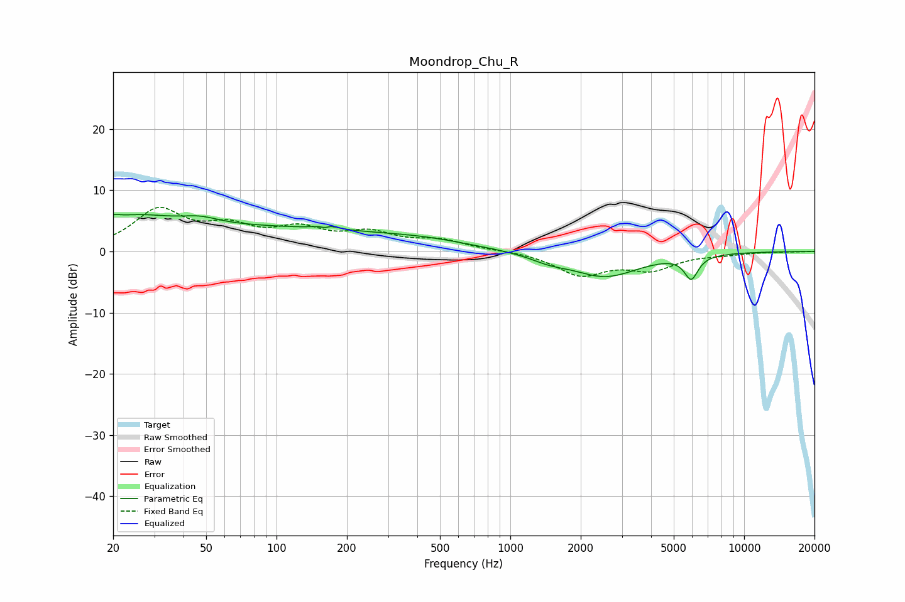

# Moondrop_Chu_R
See [usage instructions](https://github.com/jaakkopasanen/AutoEq#usage) for more options and info.

### Parametric EQs
Apply preamp of -6.1 dB when using parametric equalizer.

|   # | Type    |   Fc (Hz) |    Q |   Gain (dB) |
|-----|---------|-----------|------|-------------|
|   1 | Peaking |        20 | 5.73 |         0.7 |
|   2 | Peaking |        23 | 0.78 |         4.1 |
|   3 | Peaking |        47 | 1.74 |         1.1 |
|   4 | Peaking |        93 | 0.3  |         3.5 |
|   5 | Peaking |       161 | 5.81 |        -2.8 |
|   6 | Peaking |       162 | 4.91 |         3   |
|   7 | Peaking |       433 | 0.66 |         1.2 |
|   8 | Peaking |      1459 | 1.84 |        -0.9 |
|   9 | Peaking |      2544 | 0.97 |        -4   |
|  10 | Peaking |      5939 | 4.75 |        -3.8 |

### Fixed Band EQs
When using fixed band (also called graphic) equalizer, apply preamp of **-7.3 dB** (if available) and set gains manually with these parameters.

|   # | Type    |   Fc (Hz) |    Q |   Gain (dB) |
|-----|---------|-----------|------|-------------|
|   1 | Peaking |        31 | 1.41 |         6.4 |
|   2 | Peaking |        62 | 1.41 |         3.3 |
|   3 | Peaking |       125 | 1.41 |         3.1 |
|   4 | Peaking |       250 | 1.41 |         2.6 |
|   5 | Peaking |       500 | 1.41 |         1.6 |
|   6 | Peaking |      1000 | 1.41 |         0.1 |
|   7 | Peaking |      2000 | 1.41 |        -3.7 |
|   8 | Peaking |      4000 | 1.41 |        -2.7 |
|   9 | Peaking |      8000 | 1.41 |        -0.4 |
|  10 | Peaking |     16000 | 1.41 |        -0   |

### Graphs

