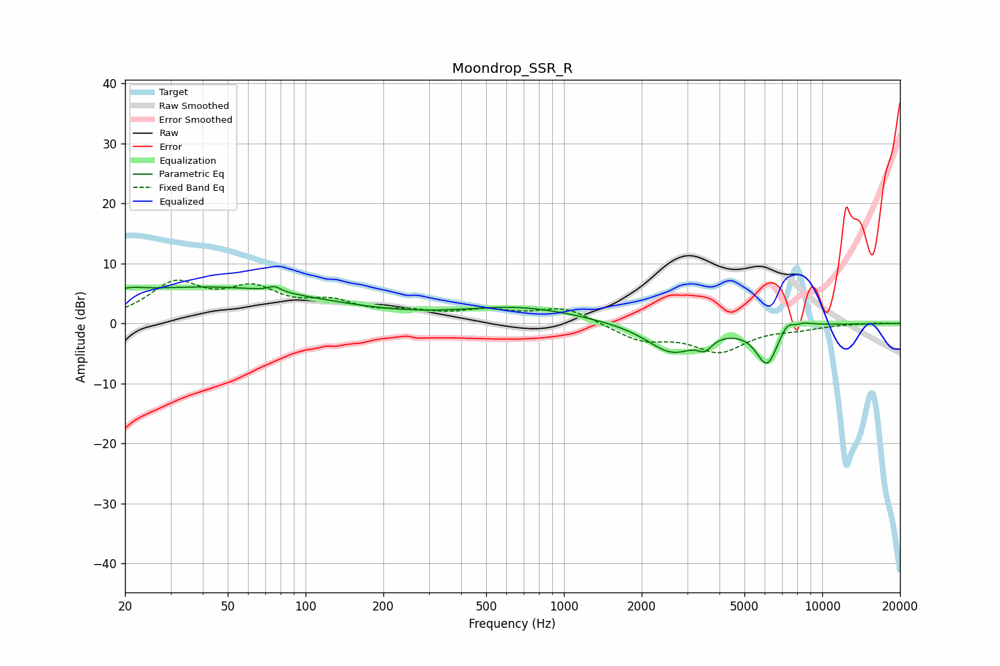

# Moondrop_SSR_R
See [usage instructions](https://github.com/jaakkopasanen/AutoEq#usage) for more options and info.

### Parametric EQs
Apply preamp of -6.2 dB when using parametric equalizer.

|   # | Type    |   Fc (Hz) |    Q |   Gain (dB) |
|-----|---------|-----------|------|-------------|
|   1 | Peaking |        20 | 2.12 |         1.2 |
|   2 | Peaking |        42 | 0.31 |         6   |
|   3 | Peaking |        76 | 5.87 |         0.9 |
|   4 | Peaking |       677 | 0.6  |         2.6 |
|   5 | Peaking |      2620 | 1.42 |        -4.9 |
|   6 | Peaking |      3516 | 5.26 |        -1.8 |
|   7 | Peaking |      6121 | 3.13 |        -6.8 |
|   8 | Peaking |      7396 | 4.13 |         2.5 |
|   9 | Peaking |      7759 | 3.73 |        -2.5 |
|  10 | Peaking |      7921 | 2.76 |         2.3 |

### Fixed Band EQs
When using fixed band (also called graphic) equalizer, apply preamp of **-7.3 dB** (if available) and set gains manually with these parameters.

|   # | Type    |   Fc (Hz) |    Q |   Gain (dB) |
|-----|---------|-----------|------|-------------|
|   1 | Peaking |        31 | 1.41 |         6.2 |
|   2 | Peaking |        62 | 1.41 |         4.8 |
|   3 | Peaking |       125 | 1.41 |         2.8 |
|   4 | Peaking |       250 | 1.41 |         1.4 |
|   5 | Peaking |       500 | 1.41 |         1.8 |
|   6 | Peaking |      1000 | 1.41 |         2.6 |
|   7 | Peaking |      2000 | 1.41 |        -2.7 |
|   8 | Peaking |      4000 | 1.41 |        -4.4 |
|   9 | Peaking |      8000 | 1.41 |        -0.7 |
|  10 | Peaking |     16000 | 1.41 |         0.1 |

### Graphs

