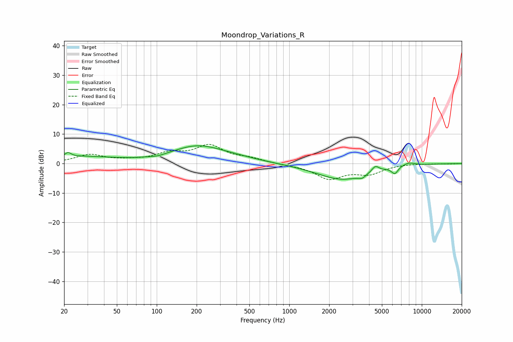

# Moondrop_Variations_R
See [usage instructions](https://github.com/jaakkopasanen/AutoEq#usage) for more options and info.

### Parametric EQs
Apply preamp of -6.1 dB when using parametric equalizer.

|   # | Type    |   Fc (Hz) |    Q |   Gain (dB) |
|-----|---------|-----------|------|-------------|
|   1 | Peaking |        21 | 5.99 |         1.6 |
|   2 | Peaking |        27 | 0.59 |         2.2 |
|   3 | Peaking |       101 | 2.77 |        -0.5 |
|   4 | Peaking |       200 | 0.72 |         5.4 |
|   5 | Peaking |       377 | 0.7  |         1.1 |
|   6 | Peaking |      2514 | 0.72 |        -5.4 |
|   7 | Peaking |      3544 | 5.25 |        -1.1 |
|   8 | Peaking |      4464 | 5.23 |         2.1 |
|   9 | Peaking |      6257 | 5.68 |        -2.4 |
|  10 | Peaking |      7939 | 2.71 |         1.1 |

### Fixed Band EQs
When using fixed band (also called graphic) equalizer, apply preamp of **-6.6 dB** (if available) and set gains manually with these parameters.

|   # | Type    |   Fc (Hz) |    Q |   Gain (dB) |
|-----|---------|-----------|------|-------------|
|   1 | Peaking |        31 | 1.41 |         2.9 |
|   2 | Peaking |        62 | 1.41 |         0.7 |
|   3 | Peaking |       125 | 1.41 |         3   |
|   4 | Peaking |       250 | 1.41 |         5.7 |
|   5 | Peaking |       500 | 1.41 |         1.4 |
|   6 | Peaking |      1000 | 1.41 |        -0.3 |
|   7 | Peaking |      2000 | 1.41 |        -4.9 |
|   8 | Peaking |      4000 | 1.41 |        -3.1 |
|   9 | Peaking |      8000 | 1.41 |         0.1 |
|  10 | Peaking |     16000 | 1.41 |        -0.1 |

### Graphs

