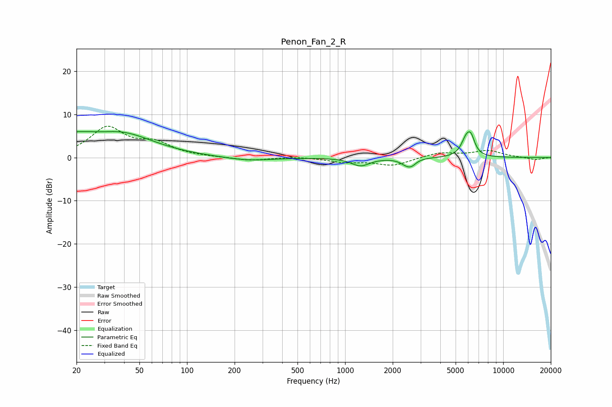

# Penon_Fan_2_R
See [usage instructions](https://github.com/jaakkopasanen/AutoEq#usage) for more options and info.

### Parametric EQs
Apply preamp of -6.1 dB when using parametric equalizer.

|   # | Type    |   Fc (Hz) |    Q |   Gain (dB) |
|-----|---------|-----------|------|-------------|
|   1 | Peaking |        20 | 5.29 |         3.6 |
|   2 | Peaking |        20 | 5.65 |        -2.3 |
|   3 | Peaking |        22 | 1.72 |         1.9 |
|   4 | Peaking |        38 | 0.67 |         5.5 |
|   5 | Peaking |       243 | 0.98 |        -0.8 |
|   6 | Peaking |      1252 | 2.48 |        -1.9 |
|   7 | Peaking |      2474 | 3.68 |        -1.6 |
|   8 | Peaking |      2656 | 5.62 |        -0.7 |
|   9 | Peaking |      5819 | 4.56 |         3.5 |
|  10 | Peaking |      6251 | 5.52 |         3.5 |

### Fixed Band EQs
When using fixed band (also called graphic) equalizer, apply preamp of **-7.4 dB** (if available) and set gains manually with these parameters.

|   # | Type    |   Fc (Hz) |    Q |   Gain (dB) |
|-----|---------|-----------|------|-------------|
|   1 | Peaking |        31 | 1.41 |         6.7 |
|   2 | Peaking |        62 | 1.41 |         2.9 |
|   3 | Peaking |       125 | 1.41 |         0.1 |
|   4 | Peaking |       250 | 1.41 |        -0.7 |
|   5 | Peaking |       500 | 1.41 |         0.2 |
|   6 | Peaking |      1000 | 1.41 |        -1   |
|   7 | Peaking |      2000 | 1.41 |        -1.8 |
|   8 | Peaking |      4000 | 1.41 |         1.2 |
|   9 | Peaking |      8000 | 1.41 |         1.5 |
|  10 | Peaking |     16000 | 1.41 |        -0.6 |

### Graphs

