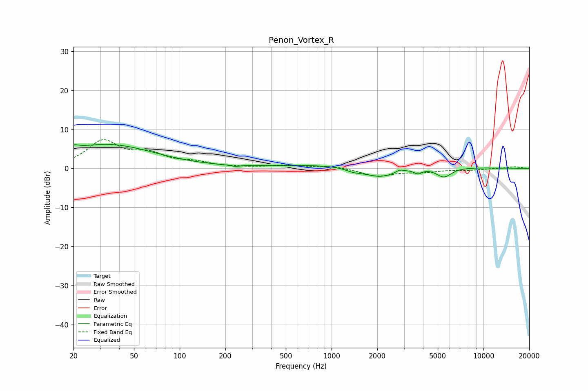

# Penon_Vortex_R
See [usage instructions](https://github.com/jaakkopasanen/AutoEq#usage) for more options and info.

### Parametric EQs
Apply preamp of -6.3 dB when using parametric equalizer.

|   # | Type    |   Fc (Hz) |    Q |   Gain (dB) |
|-----|---------|-----------|------|-------------|
|   1 | Peaking |        20 | 5.1  |         1   |
|   2 | Peaking |        29 | 0.43 |         1.1 |
|   3 | Peaking |        34 | 0.45 |         5.1 |
|   4 | Peaking |       232 | 5.82 |        -0.3 |
|   5 | Peaking |      1393 | 2.66 |        -0.8 |
|   6 | Peaking |      1665 | 0.25 |         1.1 |
|   7 | Peaking |      2090 | 1.27 |        -3   |
|   8 | Peaking |      2812 | 6    |         0.6 |
|   9 | Peaking |      3700 | 5.58 |        -1.2 |
|  10 | Peaking |      5483 | 2.72 |        -2.6 |

### Fixed Band EQs
When using fixed band (also called graphic) equalizer, apply preamp of **-7.5 dB** (if available) and set gains manually with these parameters.

|   # | Type    |   Fc (Hz) |    Q |   Gain (dB) |
|-----|---------|-----------|------|-------------|
|   1 | Peaking |        31 | 1.41 |         6.7 |
|   2 | Peaking |        62 | 1.41 |         3.1 |
|   3 | Peaking |       125 | 1.41 |         1.3 |
|   4 | Peaking |       250 | 1.41 |         0.1 |
|   5 | Peaking |       500 | 1.41 |         0.7 |
|   6 | Peaking |      1000 | 1.41 |         0.6 |
|   7 | Peaking |      2000 | 1.41 |        -2   |
|   8 | Peaking |      4000 | 1.41 |        -0.8 |
|   9 | Peaking |      8000 | 1.41 |        -0.4 |
|  10 | Peaking |     16000 | 1.41 |         0.4 |

### Graphs

