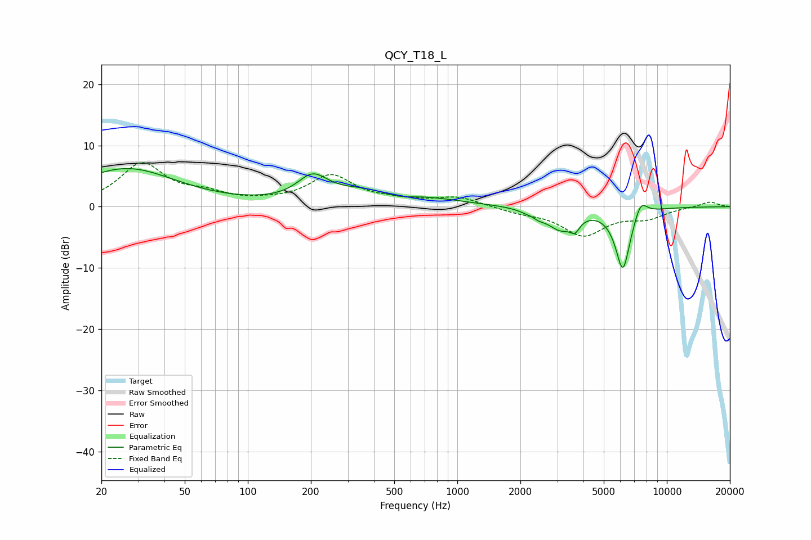

# QCY_T18_L
See [usage instructions](https://github.com/jaakkopasanen/AutoEq#usage) for more options and info.

### Parametric EQs
Apply preamp of -6.3 dB when using parametric equalizer.

|   # | Type    |   Fc (Hz) |    Q |   Gain (dB) |
|-----|---------|-----------|------|-------------|
|   1 | Peaking |        26 | 0.59 |         6.2 |
|   2 | Peaking |       204 | 1.99 |         3.7 |
|   3 | Peaking |       446 | 0.68 |         3.6 |
|   4 | Peaking |       511 | 1.41 |        -1.9 |
|   5 | Peaking |      2286 | 5.84 |         0.5 |
|   6 | Peaking |      2351 | 3.34 |        -1.4 |
|   7 | Peaking |      3108 | 2.34 |        -3.2 |
|   8 | Peaking |      3646 | 6    |        -1.8 |
|   9 | Peaking |      6171 | 3.79 |       -10.3 |
|  10 | Peaking |      7495 | 4.3  |         2.8 |

### Fixed Band EQs
When using fixed band (also called graphic) equalizer, apply preamp of **-7.3 dB** (if available) and set gains manually with these parameters.

|   # | Type    |   Fc (Hz) |    Q |   Gain (dB) |
|-----|---------|-----------|------|-------------|
|   1 | Peaking |        31 | 1.41 |         6.8 |
|   2 | Peaking |        62 | 1.41 |         1.6 |
|   3 | Peaking |       125 | 1.41 |         0.4 |
|   4 | Peaking |       250 | 1.41 |         4.9 |
|   5 | Peaking |       500 | 1.41 |         0.7 |
|   6 | Peaking |      1000 | 1.41 |         1.5 |
|   7 | Peaking |      2000 | 1.41 |        -0.8 |
|   8 | Peaking |      4000 | 1.41 |        -4.5 |
|   9 | Peaking |      8000 | 1.41 |        -1.6 |
|  10 | Peaking |     16000 | 1.41 |         0.9 |

### Graphs

