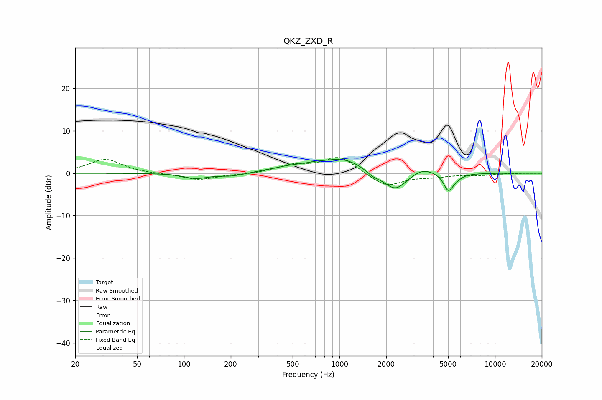

# QKZ_ZXD_R
See [usage instructions](https://github.com/jaakkopasanen/AutoEq#usage) for more options and info.

### Parametric EQs
Apply preamp of -3.3 dB when using parametric equalizer.

|   # | Type    |   Fc (Hz) |    Q |   Gain (dB) |
|-----|---------|-----------|------|-------------|
|   1 | Peaking |       119 | 1.92 |        -1.2 |
|   2 | Peaking |       204 | 1.7  |        -0.8 |
|   3 | Peaking |       496 | 1.07 |         1.2 |
|   4 | Peaking |       705 | 2.74 |         0.3 |
|   5 | Peaking |      1053 | 0.98 |         3.3 |
|   6 | Peaking |      1648 | 2.94 |        -1.2 |
|   7 | Peaking |      2285 | 1.91 |        -4.5 |
|   8 | Peaking |      3425 | 1.97 |         1.6 |
|   9 | Peaking |      5013 | 4.71 |        -3.9 |
|  10 | Peaking |      5633 | 4.15 |        -0.8 |

### Fixed Band EQs
When using fixed band (also called graphic) equalizer, apply preamp of **-3.8 dB** (if available) and set gains manually with these parameters.

|   # | Type    |   Fc (Hz) |    Q |   Gain (dB) |
|-----|---------|-----------|------|-------------|
|   1 | Peaking |        31 | 1.41 |         3.3 |
|   2 | Peaking |        62 | 1.41 |        -0.1 |
|   3 | Peaking |       125 | 1.41 |        -1.6 |
|   4 | Peaking |       250 | 1.41 |        -0.3 |
|   5 | Peaking |       500 | 1.41 |         1.7 |
|   6 | Peaking |      1000 | 1.41 |         4   |
|   7 | Peaking |      2000 | 1.41 |        -3.3 |
|   8 | Peaking |      4000 | 1.41 |        -0.7 |
|   9 | Peaking |      8000 | 1.41 |        -0.4 |
|  10 | Peaking |     16000 | 1.41 |         0   |

### Graphs

