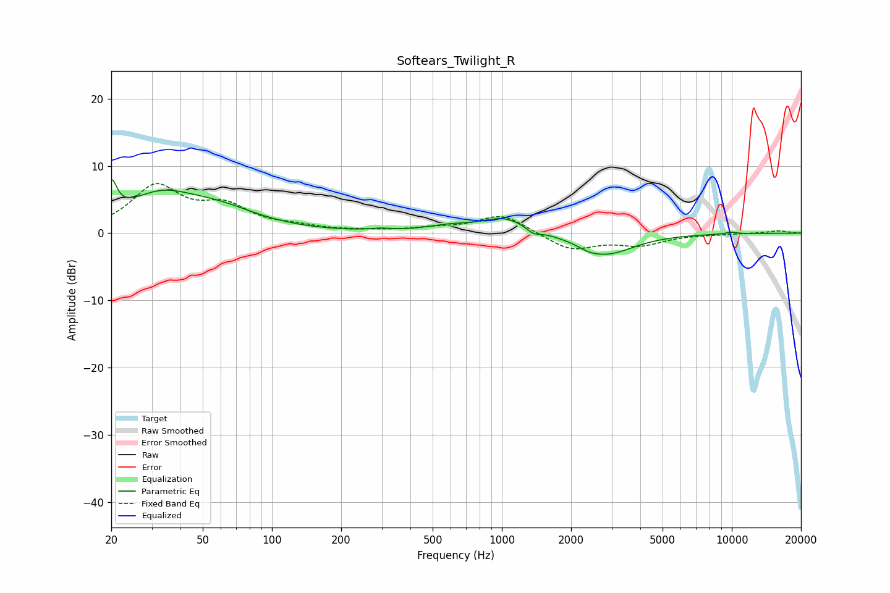

# Softears_Twilight_R
See [usage instructions](https://github.com/jaakkopasanen/AutoEq#usage) for more options and info.

### Parametric EQs
Apply preamp of -8.1 dB when using parametric equalizer.

|   # | Type    |   Fc (Hz) |    Q |   Gain (dB) |
|-----|---------|-----------|------|-------------|
|   1 | Peaking |        20 | 6    |         4.8 |
|   2 | Peaking |        32 | 0.91 |         4.9 |
|   3 | Peaking |        59 | 0.81 |         2.7 |
|   4 | Peaking |       297 | 3.12 |         0.3 |
|   5 | Peaking |       594 | 1.37 |         0.8 |
|   6 | Peaking |      1032 | 1.44 |         2.3 |
|   7 | Peaking |      1371 | 4.7  |        -0.8 |
|   8 | Peaking |      2394 | 3.48 |        -0.4 |
|   9 | Peaking |      2847 | 1.18 |        -3.1 |
|  10 | Peaking |      9924 | 4.7  |         0.3 |

### Fixed Band EQs
When using fixed band (also called graphic) equalizer, apply preamp of **-7.5 dB** (if available) and set gains manually with these parameters.

|   # | Type    |   Fc (Hz) |    Q |   Gain (dB) |
|-----|---------|-----------|------|-------------|
|   1 | Peaking |        31 | 1.41 |         6.7 |
|   2 | Peaking |        62 | 1.41 |         3.5 |
|   3 | Peaking |       125 | 1.41 |         0.7 |
|   4 | Peaking |       250 | 1.41 |         0.2 |
|   5 | Peaking |       500 | 1.41 |         0.5 |
|   6 | Peaking |      1000 | 1.41 |         2.8 |
|   7 | Peaking |      2000 | 1.41 |        -2.5 |
|   8 | Peaking |      4000 | 1.41 |        -1.6 |
|   9 | Peaking |      8000 | 1.41 |        -0.1 |
|  10 | Peaking |     16000 | 1.41 |         0.4 |

### Graphs

