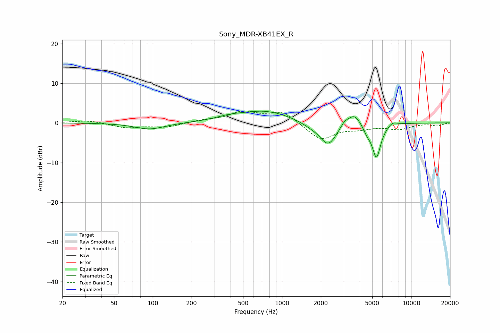

# Sony_MDR-XB41EX_R
See [usage instructions](https://github.com/jaakkopasanen/AutoEq#usage) for more options and info.

### Parametric EQs
Apply preamp of -3.0 dB when using parametric equalizer.

|   # | Type    |   Fc (Hz) |    Q |   Gain (dB) |
|-----|---------|-----------|------|-------------|
|   1 | Peaking |        95 | 1.22 |        -1.6 |
|   2 | Peaking |       393 | 1.29 |         0.8 |
|   3 | Peaking |       746 | 0.72 |         2.9 |
|   4 | Peaking |      1683 | 1.73 |        -0.8 |
|   5 | Peaking |      2282 | 2.13 |        -5.7 |
|   6 | Peaking |      3052 | 4.55 |         1.2 |
|   7 | Peaking |      3630 | 2.85 |         3   |
|   8 | Peaking |      4547 | 4.99 |        -1.5 |
|   9 | Peaking |      5391 | 4.08 |        -8.7 |
|  10 | Peaking |      7179 | 3.73 |         1   |

### Fixed Band EQs
When using fixed band (also called graphic) equalizer, apply preamp of **-3.1 dB** (if available) and set gains manually with these parameters.

|   # | Type    |   Fc (Hz) |    Q |   Gain (dB) |
|-----|---------|-----------|------|-------------|
|   1 | Peaking |        31 | 1.41 |         0.7 |
|   2 | Peaking |        62 | 1.41 |        -1.2 |
|   3 | Peaking |       125 | 1.41 |        -1.1 |
|   4 | Peaking |       250 | 1.41 |         0.6 |
|   5 | Peaking |       500 | 1.41 |         2.6 |
|   6 | Peaking |      1000 | 1.41 |         2.9 |
|   7 | Peaking |      2000 | 1.41 |        -4.3 |
|   8 | Peaking |      4000 | 1.41 |        -1.1 |
|   9 | Peaking |      8000 | 1.41 |        -1.4 |
|  10 | Peaking |     16000 | 1.41 |        -0.7 |

### Graphs

