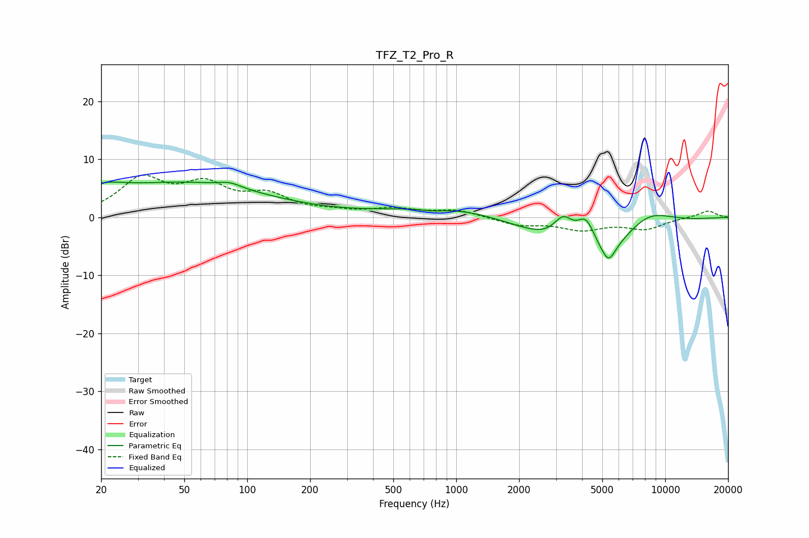

# TFZ_T2_Pro_R
See [usage instructions](https://github.com/jaakkopasanen/AutoEq#usage) for more options and info.

### Parametric EQs
Apply preamp of -6.2 dB when using parametric equalizer.

|   # | Type    |   Fc (Hz) |    Q |   Gain (dB) |
|-----|---------|-----------|------|-------------|
|   1 | Peaking |        20 | 1.36 |         2.2 |
|   2 | Peaking |        50 | 0.36 |         5.7 |
|   3 | Peaking |        82 | 2.63 |         0.8 |
|   4 | Peaking |       773 | 2.55 |        -0.5 |
|   5 | Peaking |       966 | 0.51 |         2   |
|   6 | Peaking |      3257 | 2.89 |         4.4 |
|   7 | Peaking |      4175 | 2.89 |         5.8 |
|   8 | Peaking |      4579 | 0.63 |        -8.9 |
|   9 | Peaking |      5359 | 4.26 |        -3.1 |
|  10 | Peaking |      8115 | 1.02 |         4.4 |

### Fixed Band EQs
When using fixed band (also called graphic) equalizer, apply preamp of **-7.4 dB** (if available) and set gains manually with these parameters.

|   # | Type    |   Fc (Hz) |    Q |   Gain (dB) |
|-----|---------|-----------|------|-------------|
|   1 | Peaking |        31 | 1.41 |         6.2 |
|   2 | Peaking |        62 | 1.41 |         4.9 |
|   3 | Peaking |       125 | 1.41 |         3.3 |
|   4 | Peaking |       250 | 1.41 |         0.7 |
|   5 | Peaking |       500 | 1.41 |         1.3 |
|   6 | Peaking |      1000 | 1.41 |         1.2 |
|   7 | Peaking |      2000 | 1.41 |        -1.3 |
|   8 | Peaking |      4000 | 1.41 |        -1.9 |
|   9 | Peaking |      8000 | 1.41 |        -1.9 |
|  10 | Peaking |     16000 | 1.41 |         1.2 |

### Graphs

