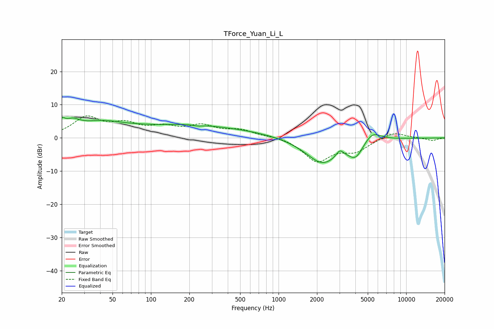

# TForce_Yuan_Li_L
See [usage instructions](https://github.com/jaakkopasanen/AutoEq#usage) for more options and info.

### Parametric EQs
Apply preamp of -6.3 dB when using parametric equalizer.

|   # | Type    |   Fc (Hz) |    Q |   Gain (dB) |
|-----|---------|-----------|------|-------------|
|   1 | Peaking |        20 | 5.86 |         2.5 |
|   2 | Peaking |        24 | 2.27 |         3   |
|   3 | Peaking |        40 | 0.94 |         2.5 |
|   4 | Peaking |       162 | 0.2  |         3.6 |
|   5 | Peaking |       224 | 1.44 |         0.7 |
|   6 | Peaking |       231 | 3.04 |        -0.6 |
|   7 | Peaking |      2211 | 1.04 |        -7.8 |
|   8 | Peaking |      3020 | 5.04 |         2.1 |
|   9 | Peaking |      4028 | 2.43 |        -4.5 |
|  10 | Peaking |      5416 | 2.05 |         3.3 |

### Fixed Band EQs
When using fixed band (also called graphic) equalizer, apply preamp of **-6.7 dB** (if available) and set gains manually with these parameters.

|   # | Type    |   Fc (Hz) |    Q |   Gain (dB) |
|-----|---------|-----------|------|-------------|
|   1 | Peaking |        31 | 1.41 |         5.8 |
|   2 | Peaking |        62 | 1.41 |         3.5 |
|   3 | Peaking |       125 | 1.41 |         2.6 |
|   4 | Peaking |       250 | 1.41 |         3.2 |
|   5 | Peaking |       500 | 1.41 |         2.1 |
|   6 | Peaking |      1000 | 1.41 |         0.6 |
|   7 | Peaking |      2000 | 1.41 |        -6.9 |
|   8 | Peaking |      4000 | 1.41 |        -3.5 |
|   9 | Peaking |      8000 | 1.41 |         1.9 |
|  10 | Peaking |     16000 | 1.41 |        -0.8 |

### Graphs

