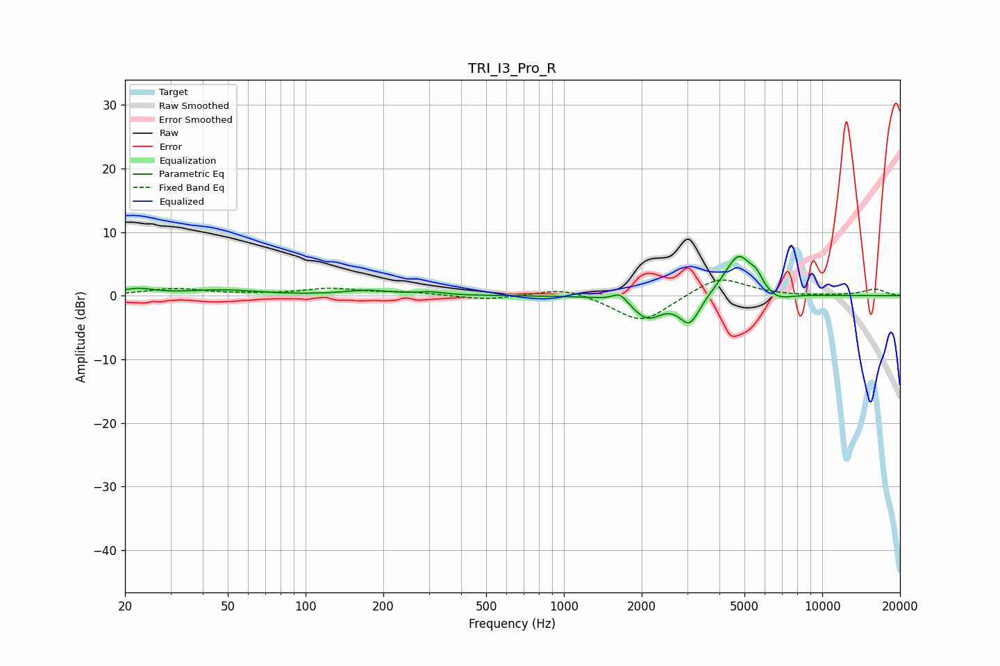

# TRI_I3_Pro_R
See [usage instructions](https://github.com/jaakkopasanen/AutoEq#usage) for more options and info.

### Parametric EQs
Apply preamp of -6.2 dB when using parametric equalizer.

|   # | Type    |   Fc (Hz) |    Q |   Gain (dB) |
|-----|---------|-----------|------|-------------|
|   1 | Peaking |        22 | 2.25 |         1   |
|   2 | Peaking |        48 | 1.05 |         0.8 |
|   3 | Peaking |       173 | 1.61 |         0.8 |
|   4 | Peaking |       303 | 2.75 |         0.4 |
|   5 | Peaking |      1648 | 5.02 |         1.5 |
|   6 | Peaking |      2106 | 2.44 |        -3.5 |
|   7 | Peaking |      3069 | 3.51 |        -4.5 |
|   8 | Peaking |      4745 | 2.48 |         6.8 |
|   9 | Peaking |      5577 | 5.83 |         1.5 |
|  10 | Peaking |      6620 | 2.36 |        -1.5 |

### Fixed Band EQs
When using fixed band (also called graphic) equalizer, apply preamp of **-2.6 dB** (if available) and set gains manually with these parameters.

|   # | Type    |   Fc (Hz) |    Q |   Gain (dB) |
|-----|---------|-----------|------|-------------|
|   1 | Peaking |        31 | 1.41 |         1.1 |
|   2 | Peaking |        62 | 1.41 |         0.1 |
|   3 | Peaking |       125 | 1.41 |         1   |
|   4 | Peaking |       250 | 1.41 |         0.5 |
|   5 | Peaking |       500 | 1.41 |        -0.7 |
|   6 | Peaking |      1000 | 1.41 |         1.4 |
|   7 | Peaking |      2000 | 1.41 |        -4.4 |
|   8 | Peaking |      4000 | 1.41 |         3.1 |
|   9 | Peaking |      8000 | 1.41 |        -0.1 |
|  10 | Peaking |     16000 | 1.41 |         1   |

### Graphs

