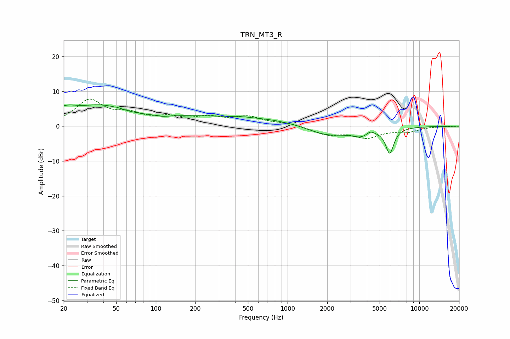

# TRN_MT3_R
See [usage instructions](https://github.com/jaakkopasanen/AutoEq#usage) for more options and info.

### Parametric EQs
Apply preamp of -6.3 dB when using parametric equalizer.

|   # | Type    |   Fc (Hz) |    Q |   Gain (dB) |
|-----|---------|-----------|------|-------------|
|   1 | Peaking |        20 | 1.39 |         3.6 |
|   2 | Peaking |        38 | 0.82 |         4.6 |
|   3 | Peaking |        52 | 4.94 |         0.2 |
|   4 | Peaking |       113 | 3.57 |        -0.4 |
|   5 | Peaking |       306 | 0.21 |         2.9 |
|   6 | Peaking |       466 | 4.39 |         0.1 |
|   7 | Peaking |      1974 | 0.88 |        -3.1 |
|   8 | Peaking |      3666 | 1.85 |        -2.1 |
|   9 | Peaking |      4236 | 4.63 |         1.2 |
|  10 | Peaking |      5961 | 4.38 |        -7.2 |

### Fixed Band EQs
When using fixed band (also called graphic) equalizer, apply preamp of **-7.9 dB** (if available) and set gains manually with these parameters.

|   # | Type    |   Fc (Hz) |    Q |   Gain (dB) |
|-----|---------|-----------|------|-------------|
|   1 | Peaking |        31 | 1.41 |         7.2 |
|   2 | Peaking |        62 | 1.41 |         2.8 |
|   3 | Peaking |       125 | 1.41 |         2   |
|   4 | Peaking |       250 | 1.41 |         2.2 |
|   5 | Peaking |       500 | 1.41 |         2.4 |
|   6 | Peaking |      1000 | 1.41 |         0.8 |
|   7 | Peaking |      2000 | 1.41 |        -2.3 |
|   8 | Peaking |      4000 | 1.41 |        -3   |
|   9 | Peaking |      8000 | 1.41 |        -1.4 |
|  10 | Peaking |     16000 | 1.41 |         0   |

### Graphs

