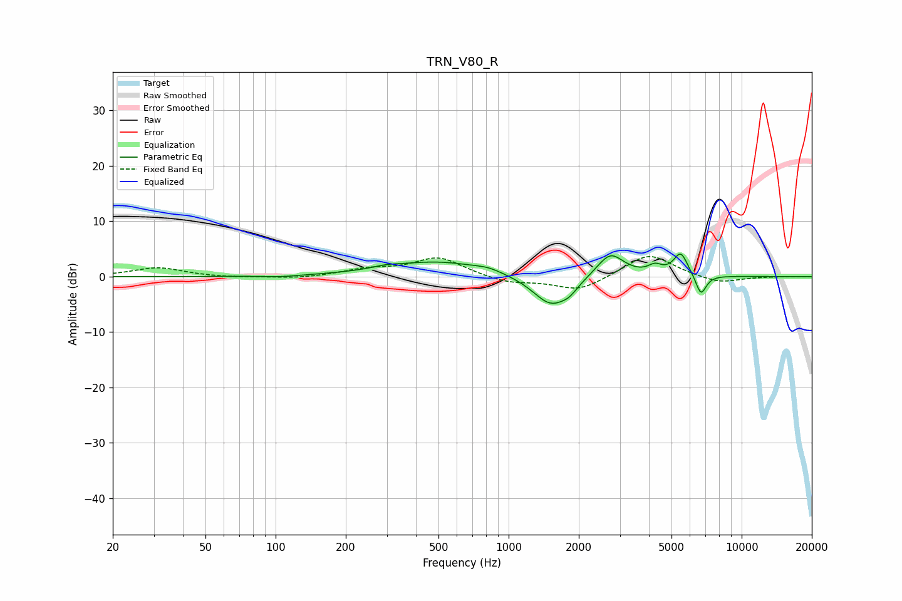

# TRN_V80_R
See [usage instructions](https://github.com/jaakkopasanen/AutoEq#usage) for more options and info.

### Parametric EQs
Apply preamp of -4.2 dB when using parametric equalizer.

|   # | Type    |   Fc (Hz) |    Q |   Gain (dB) |
|-----|---------|-----------|------|-------------|
|   1 | Peaking |       105 | 1.94 |        -0.3 |
|   2 | Peaking |       297 | 2.74 |         0.4 |
|   3 | Peaking |       495 | 0.66 |         2.7 |
|   4 | Peaking |       819 | 2.59 |         0.5 |
|   5 | Peaking |      1518 | 1.79 |        -5.5 |
|   6 | Peaking |      1822 | 3.93 |        -1.2 |
|   7 | Peaking |      2732 | 2.42 |         4.4 |
|   8 | Peaking |      4249 | 4.67 |         1.4 |
|   9 | Peaking |      5475 | 4.5  |         4.2 |
|  10 | Peaking |      6689 | 6    |        -3.8 |

### Fixed Band EQs
When using fixed band (also called graphic) equalizer, apply preamp of **-3.7 dB** (if available) and set gains manually with these parameters.

|   # | Type    |   Fc (Hz) |    Q |   Gain (dB) |
|-----|---------|-----------|------|-------------|
|   1 | Peaking |        31 | 1.41 |         1.6 |
|   2 | Peaking |        62 | 1.41 |        -0.2 |
|   3 | Peaking |       125 | 1.41 |        -0.4 |
|   4 | Peaking |       250 | 1.41 |         1.2 |
|   5 | Peaking |       500 | 1.41 |         3.4 |
|   6 | Peaking |      1000 | 1.41 |        -1.2 |
|   7 | Peaking |      2000 | 1.41 |        -2.6 |
|   8 | Peaking |      4000 | 1.41 |         4.3 |
|   9 | Peaking |      8000 | 1.41 |        -1.3 |
|  10 | Peaking |     16000 | 1.41 |         0   |

### Graphs

