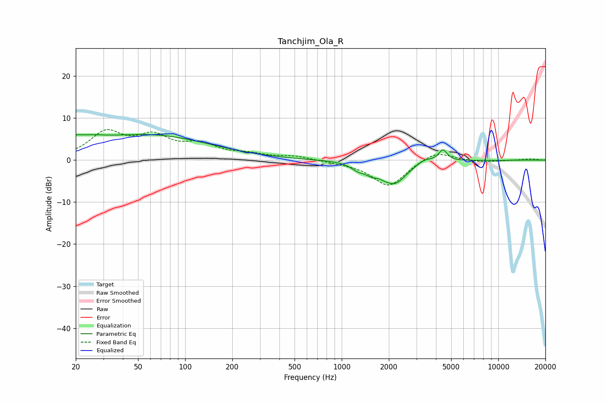

# Tanchjim_Ola_R
See [usage instructions](https://github.com/jaakkopasanen/AutoEq#usage) for more options and info.

### Parametric EQs
Apply preamp of -6.2 dB when using parametric equalizer.

|   # | Type    |   Fc (Hz) |    Q |   Gain (dB) |
|-----|---------|-----------|------|-------------|
|   1 | Peaking |        20 | 5.46 |         0.8 |
|   2 | Peaking |        22 | 1.15 |         2.5 |
|   3 | Peaking |        61 | 0.37 |         5.7 |
|   4 | Peaking |      1275 | 3.15 |        -1.5 |
|   5 | Peaking |      1554 | 3.71 |        -1.5 |
|   6 | Peaking |      1850 | 5.77 |        -0.4 |
|   7 | Peaking |      2171 | 1.8  |        -5.4 |
|   8 | Peaking |      3369 | 2.8  |         1.1 |
|   9 | Peaking |      4429 | 5.16 |         2.7 |
|  10 | Peaking |     10000 | 5.17 |        -0.1 |

### Fixed Band EQs
When using fixed band (also called graphic) equalizer, apply preamp of **-7.4 dB** (if available) and set gains manually with these parameters.

|   # | Type    |   Fc (Hz) |    Q |   Gain (dB) |
|-----|---------|-----------|------|-------------|
|   1 | Peaking |        31 | 1.41 |         6.2 |
|   2 | Peaking |        62 | 1.41 |         4.9 |
|   3 | Peaking |       125 | 1.41 |         3.2 |
|   4 | Peaking |       250 | 1.41 |         1.1 |
|   5 | Peaking |       500 | 1.41 |         0.9 |
|   6 | Peaking |      1000 | 1.41 |        -0.4 |
|   7 | Peaking |      2000 | 1.41 |        -6.3 |
|   8 | Peaking |      4000 | 1.41 |         2.4 |
|   9 | Peaking |      8000 | 1.41 |        -0.5 |
|  10 | Peaking |     16000 | 1.41 |         0.3 |

### Graphs

