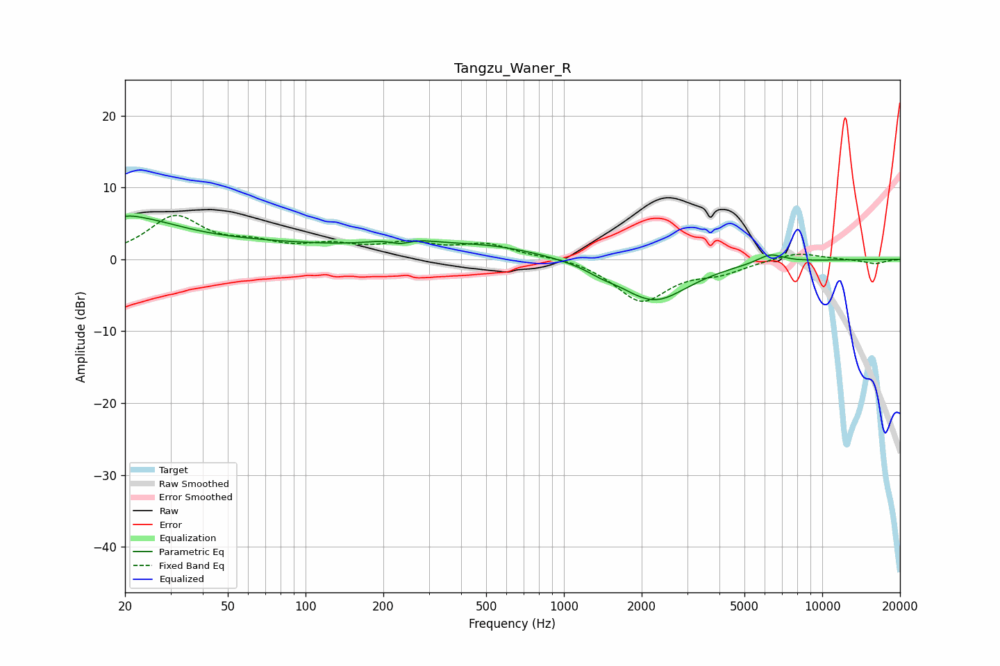

# Tangzu_Waner_R
See [usage instructions](https://github.com/jaakkopasanen/AutoEq#usage) for more options and info.

### Parametric EQs
Apply preamp of -6.1 dB when using parametric equalizer.

|   # | Type    |   Fc (Hz) |    Q |   Gain (dB) |
|-----|---------|-----------|------|-------------|
|   1 | Peaking |        20 | 0.7  |         5.2 |
|   2 | Peaking |        20 | 5.93 |        -3.2 |
|   3 | Peaking |        20 | 5.69 |         3.4 |
|   4 | Peaking |        73 | 0.39 |         1.7 |
|   5 | Peaking |       233 | 2.75 |        -1.7 |
|   6 | Peaking |       234 | 1.61 |         2.3 |
|   7 | Peaking |       505 | 0.6  |         1.8 |
|   8 | Peaking |      1394 | 2.73 |        -0.5 |
|   9 | Peaking |      2230 | 1.03 |        -5.8 |
|  10 | Peaking |      6292 | 2.65 |         1.3 |

### Fixed Band EQs
When using fixed band (also called graphic) equalizer, apply preamp of **-6.2 dB** (if available) and set gains manually with these parameters.

|   # | Type    |   Fc (Hz) |    Q |   Gain (dB) |
|-----|---------|-----------|------|-------------|
|   1 | Peaking |        31 | 1.41 |         5.7 |
|   2 | Peaking |        62 | 1.41 |         1.6 |
|   3 | Peaking |       125 | 1.41 |         1.6 |
|   4 | Peaking |       250 | 1.41 |         1.9 |
|   5 | Peaking |       500 | 1.41 |         1.9 |
|   6 | Peaking |      1000 | 1.41 |         0.4 |
|   7 | Peaking |      2000 | 1.41 |        -5.8 |
|   8 | Peaking |      4000 | 1.41 |        -1.5 |
|   9 | Peaking |      8000 | 1.41 |         1.1 |
|  10 | Peaking |     16000 | 1.41 |        -0.6 |

### Graphs

