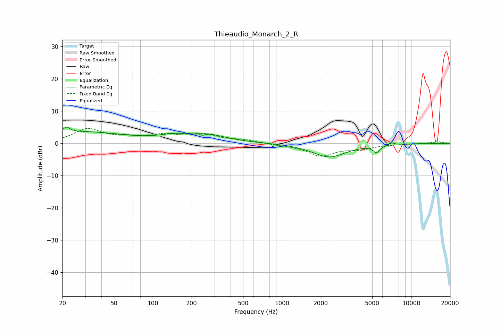

# Thieaudio_Monarch_2_R
See [usage instructions](https://github.com/jaakkopasanen/AutoEq#usage) for more options and info.

### Parametric EQs
Apply preamp of -5.2 dB when using parametric equalizer.

|   # | Type    |   Fc (Hz) |    Q |   Gain (dB) |
|-----|---------|-----------|------|-------------|
|   1 | Peaking |        21 | 5.6  |         1.7 |
|   2 | Peaking |        28 | 0.43 |         3.5 |
|   3 | Peaking |       140 | 1.52 |         0.4 |
|   4 | Peaking |       182 | 2.27 |        -1.4 |
|   5 | Peaking |       184 | 1.31 |         1.3 |
|   6 | Peaking |       224 | 0.8  |         2.9 |
|   7 | Peaking |       241 | 5.85 |        -1   |
|   8 | Peaking |      2325 | 1.1  |        -4.2 |
|   9 | Peaking |      5411 | 5.26 |        -2.2 |
|  10 | Peaking |      7036 | 5.95 |         0.7 |

### Fixed Band EQs
When using fixed band (also called graphic) equalizer, apply preamp of **-4.8 dB** (if available) and set gains manually with these parameters.

|   # | Type    |   Fc (Hz) |    Q |   Gain (dB) |
|-----|---------|-----------|------|-------------|
|   1 | Peaking |        31 | 1.41 |         4.3 |
|   2 | Peaking |        62 | 1.41 |         1.5 |
|   3 | Peaking |       125 | 1.41 |         2.3 |
|   4 | Peaking |       250 | 1.41 |         2.5 |
|   5 | Peaking |       500 | 1.41 |         0.9 |
|   6 | Peaking |      1000 | 1.41 |        -0.4 |
|   7 | Peaking |      2000 | 1.41 |        -3.7 |
|   8 | Peaking |      4000 | 1.41 |        -1.5 |
|   9 | Peaking |      8000 | 1.41 |        -0.2 |
|  10 | Peaking |     16000 | 1.41 |         0.5 |

### Graphs

