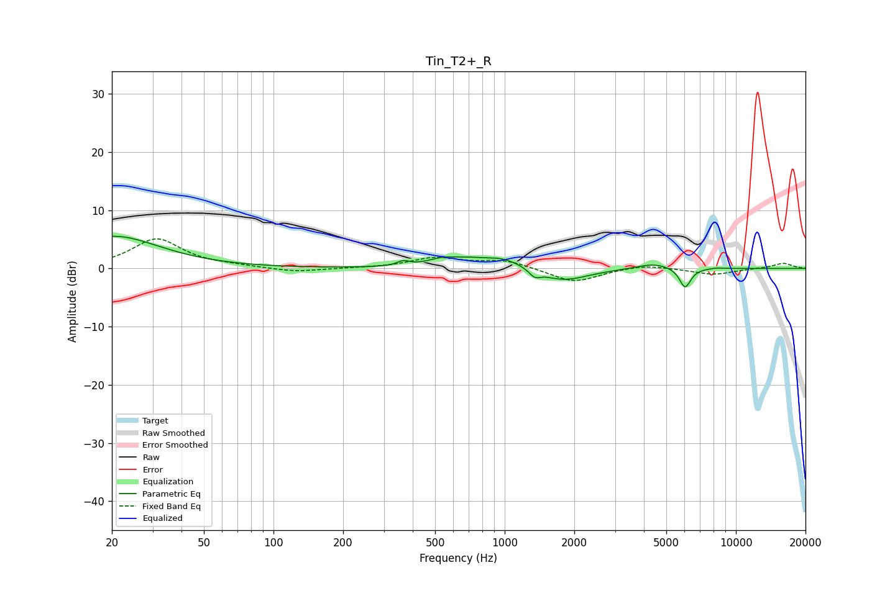

# Tin_T2+_R
See [usage instructions](https://github.com/jaakkopasanen/AutoEq#usage) for more options and info.

### Parametric EQs
Apply preamp of -5.6 dB when using parametric equalizer.

|   # | Type    |   Fc (Hz) |    Q |   Gain (dB) |
|-----|---------|-----------|------|-------------|
|   1 | Peaking |        20 | 0.71 |         5.5 |
|   2 | Peaking |       364 | 5.57 |         0.8 |
|   3 | Peaking |       540 | 2.29 |         0.9 |
|   4 | Peaking |       834 | 2.42 |        -0.9 |
|   5 | Peaking |       869 | 1.21 |         3   |
|   6 | Peaking |      1347 | 5.98 |        -1.2 |
|   7 | Peaking |      1768 | 1.27 |        -2.4 |
|   8 | Peaking |      4419 | 1.86 |         1   |
|   9 | Peaking |      6030 | 5.66 |        -3.5 |
|  10 | Peaking |      8230 | 4.91 |         0.2 |

### Fixed Band EQs
When using fixed band (also called graphic) equalizer, apply preamp of **-5.2 dB** (if available) and set gains manually with these parameters.

|   # | Type    |   Fc (Hz) |    Q |   Gain (dB) |
|-----|---------|-----------|------|-------------|
|   1 | Peaking |        31 | 1.41 |         5   |
|   2 | Peaking |        62 | 1.41 |         0.3 |
|   3 | Peaking |       125 | 1.41 |        -0.7 |
|   4 | Peaking |       250 | 1.41 |         0   |
|   5 | Peaking |       500 | 1.41 |         1.7 |
|   6 | Peaking |      1000 | 1.41 |         1.4 |
|   7 | Peaking |      2000 | 1.41 |        -2.5 |
|   8 | Peaking |      4000 | 1.41 |         0.7 |
|   9 | Peaking |      8000 | 1.41 |        -1.1 |
|  10 | Peaking |     16000 | 1.41 |         0.9 |

### Graphs

