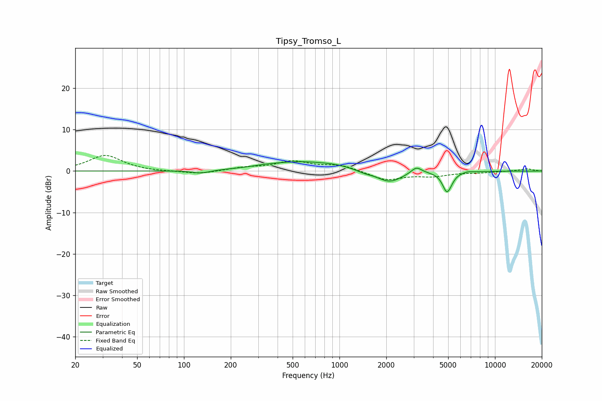

# Tipsy_Tromso_L
See [usage instructions](https://github.com/jaakkopasanen/AutoEq#usage) for more options and info.

### Parametric EQs
Apply preamp of -2.3 dB when using parametric equalizer.

|   # | Type    |   Fc (Hz) |    Q |   Gain (dB) |
|-----|---------|-----------|------|-------------|
|   1 | Peaking |       128 | 2.34 |        -0.7 |
|   2 | Peaking |       337 | 2.03 |         0.2 |
|   3 | Peaking |       571 | 0.61 |         2.3 |
|   4 | Peaking |       949 | 1.81 |         0.3 |
|   5 | Peaking |      1449 | 3.03 |        -0.5 |
|   6 | Peaking |      2096 | 1.71 |        -2.9 |
|   7 | Peaking |      3123 | 4.17 |         1.6 |
|   8 | Peaking |      4907 | 4.92 |        -4.7 |
|   9 | Peaking |      5244 | 6    |        -0.4 |
|  10 | Peaking |      6653 | 5.56 |         0.2 |

### Fixed Band EQs
When using fixed band (also called graphic) equalizer, apply preamp of **-3.9 dB** (if available) and set gains manually with these parameters.

|   # | Type    |   Fc (Hz) |    Q |   Gain (dB) |
|-----|---------|-----------|------|-------------|
|   1 | Peaking |        31 | 1.41 |         3.8 |
|   2 | Peaking |        62 | 1.41 |        -0.1 |
|   3 | Peaking |       125 | 1.41 |        -0.8 |
|   4 | Peaking |       250 | 1.41 |         0.7 |
|   5 | Peaking |       500 | 1.41 |         2.2 |
|   6 | Peaking |      1000 | 1.41 |         1.4 |
|   7 | Peaking |      2000 | 1.41 |        -2.2 |
|   8 | Peaking |      4000 | 1.41 |        -1.1 |
|   9 | Peaking |      8000 | 1.41 |        -0.3 |
|  10 | Peaking |     16000 | 1.41 |         0.6 |

### Graphs

