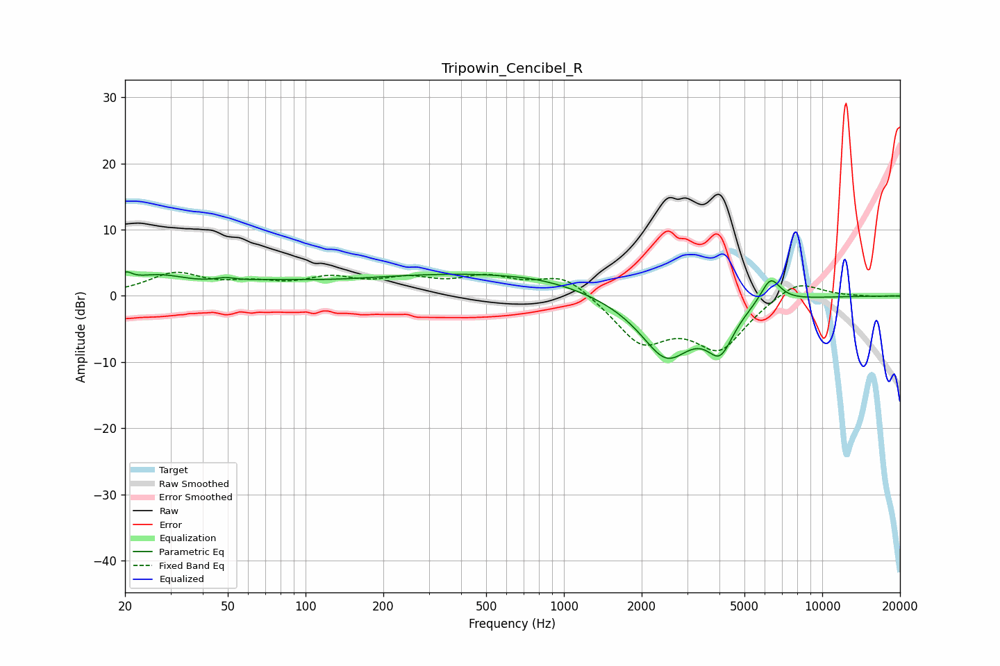

# Tripowin_Cencibel_R
See [usage instructions](https://github.com/jaakkopasanen/AutoEq#usage) for more options and info.

### Parametric EQs
Apply preamp of -3.7 dB when using parametric equalizer.

|   # | Type    |   Fc (Hz) |    Q |   Gain (dB) |
|-----|---------|-----------|------|-------------|
|   1 | Peaking |        20 | 5.78 |         1.5 |
|   2 | Peaking |        27 | 1.14 |         2.6 |
|   3 | Peaking |        49 | 3.45 |         0.6 |
|   4 | Peaking |        71 | 0.82 |         1.2 |
|   5 | Peaking |       378 | 0.32 |         3   |
|   6 | Peaking |       640 | 1.06 |        -0.4 |
|   7 | Peaking |       729 | 0.81 |         1.1 |
|   8 | Peaking |      2494 | 1.33 |        -9.4 |
|   9 | Peaking |      4028 | 2.67 |        -6.2 |
|  10 | Peaking |      6306 | 3.55 |         3.9 |

### Fixed Band EQs
When using fixed band (also called graphic) equalizer, apply preamp of **-3.7 dB** (if available) and set gains manually with these parameters.

|   # | Type    |   Fc (Hz) |    Q |   Gain (dB) |
|-----|---------|-----------|------|-------------|
|   1 | Peaking |        31 | 1.41 |         3.2 |
|   2 | Peaking |        62 | 1.41 |         1.5 |
|   3 | Peaking |       125 | 1.41 |         2.3 |
|   4 | Peaking |       250 | 1.41 |         2.1 |
|   5 | Peaking |       500 | 1.41 |         2.5 |
|   6 | Peaking |      1000 | 1.41 |         3.4 |
|   7 | Peaking |      2000 | 1.41 |        -6.7 |
|   8 | Peaking |      4000 | 1.41 |        -7.5 |
|   9 | Peaking |      8000 | 1.41 |         2.8 |
|  10 | Peaking |     16000 | 1.41 |        -0.1 |

### Graphs

