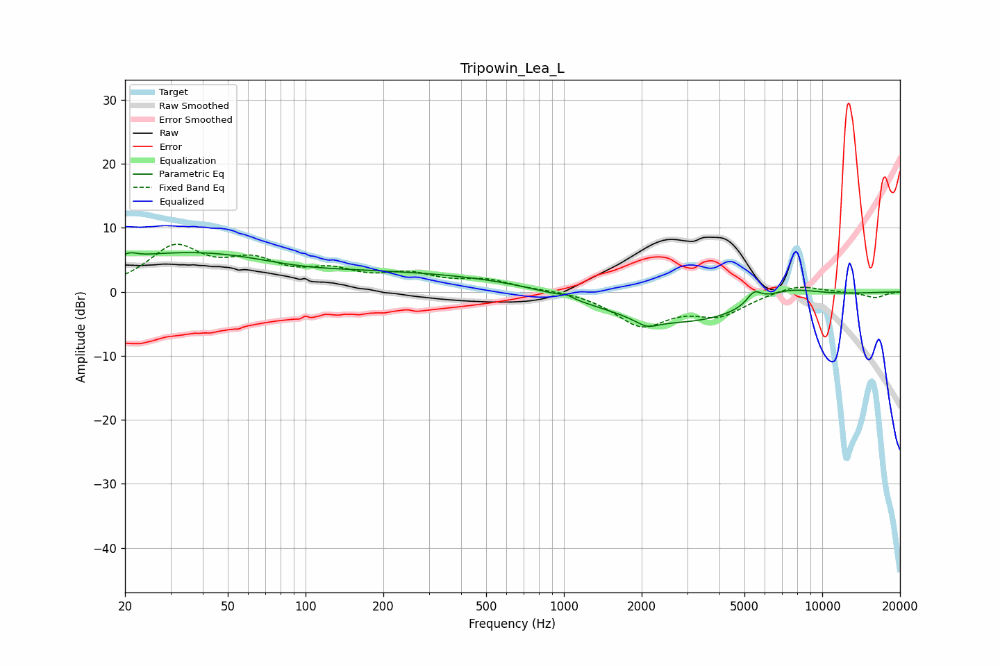

# Tripowin_Lea_L
See [usage instructions](https://github.com/jaakkopasanen/AutoEq#usage) for more options and info.

### Parametric EQs
Apply preamp of -6.2 dB when using parametric equalizer.

|   # | Type    |   Fc (Hz) |    Q |   Gain (dB) |
|-----|---------|-----------|------|-------------|
|   1 | Peaking |        21 | 5.1  |         0.7 |
|   2 | Peaking |        30 | 0.34 |         5.1 |
|   3 | Peaking |        86 | 5.89 |        -0   |
|   4 | Peaking |        91 | 0.71 |        -1.3 |
|   5 | Peaking |       212 | 0.18 |         3   |
|   6 | Peaking |      1024 | 5.93 |         0.5 |
|   7 | Peaking |      2096 | 3.18 |        -1.3 |
|   8 | Peaking |      2844 | 0.4  |        -5.4 |
|   9 | Peaking |      5445 | 4.94 |         1.9 |
|  10 | Peaking |      7182 | 1.02 |         2.7 |

### Fixed Band EQs
When using fixed band (also called graphic) equalizer, apply preamp of **-7.5 dB** (if available) and set gains manually with these parameters.

|   # | Type    |   Fc (Hz) |    Q |   Gain (dB) |
|-----|---------|-----------|------|-------------|
|   1 | Peaking |        31 | 1.41 |         6.6 |
|   2 | Peaking |        62 | 1.41 |         3.9 |
|   3 | Peaking |       125 | 1.41 |         2.6 |
|   4 | Peaking |       250 | 1.41 |         2.3 |
|   5 | Peaking |       500 | 1.41 |         1.6 |
|   6 | Peaking |      1000 | 1.41 |         0.3 |
|   7 | Peaking |      2000 | 1.41 |        -5.1 |
|   8 | Peaking |      4000 | 1.41 |        -3.3 |
|   9 | Peaking |      8000 | 1.41 |         1.3 |
|  10 | Peaking |     16000 | 1.41 |        -0.9 |

### Graphs

