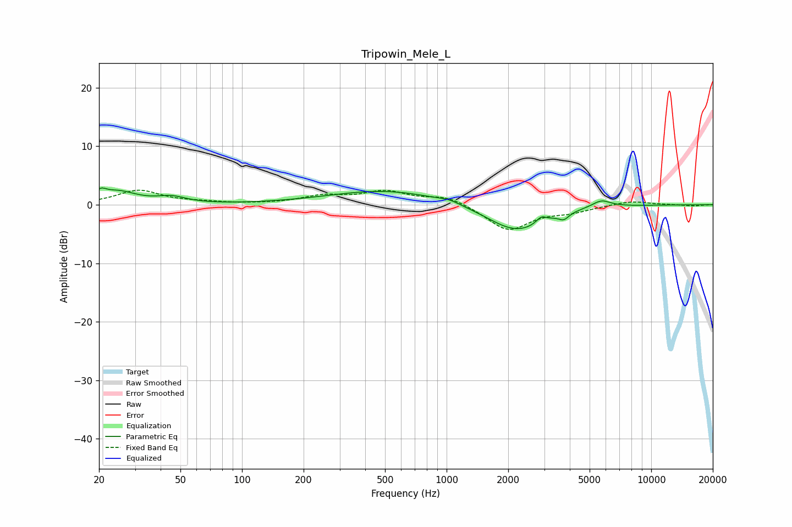

# Tripowin_Mele_L
See [usage instructions](https://github.com/jaakkopasanen/AutoEq#usage) for more options and info.

### Parametric EQs
Apply preamp of -3.0 dB when using parametric equalizer.

|   # | Type    |   Fc (Hz) |    Q |   Gain (dB) |
|-----|---------|-----------|------|-------------|
|   1 | Peaking |        20 | 5.8  |         1.1 |
|   2 | Peaking |        25 | 1.55 |         2.1 |
|   3 | Peaking |        45 | 2.01 |         1.1 |
|   4 | Peaking |       506 | 0.5  |         2.5 |
|   5 | Peaking |      1031 | 2.82 |         0.5 |
|   6 | Peaking |      2134 | 1.01 |        -4.2 |
|   7 | Peaking |      2574 | 1.51 |        -0.5 |
|   8 | Peaking |      2900 | 5.73 |         1.1 |
|   9 | Peaking |      3740 | 5.71 |        -1.1 |
|  10 | Peaking |      5703 | 3    |         1.2 |

### Fixed Band EQs
When using fixed band (also called graphic) equalizer, apply preamp of **-2.6 dB** (if available) and set gains manually with these parameters.

|   # | Type    |   Fc (Hz) |    Q |   Gain (dB) |
|-----|---------|-----------|------|-------------|
|   1 | Peaking |        31 | 1.41 |         2.4 |
|   2 | Peaking |        62 | 1.41 |         0.3 |
|   3 | Peaking |       125 | 1.41 |         0.1 |
|   4 | Peaking |       250 | 1.41 |         1.3 |
|   5 | Peaking |       500 | 1.41 |         2.1 |
|   6 | Peaking |      1000 | 1.41 |         1.5 |
|   7 | Peaking |      2000 | 1.41 |        -4.4 |
|   8 | Peaking |      4000 | 1.41 |        -1   |
|   9 | Peaking |      8000 | 1.41 |         0.7 |
|  10 | Peaking |     16000 | 1.41 |        -0.2 |

### Graphs

