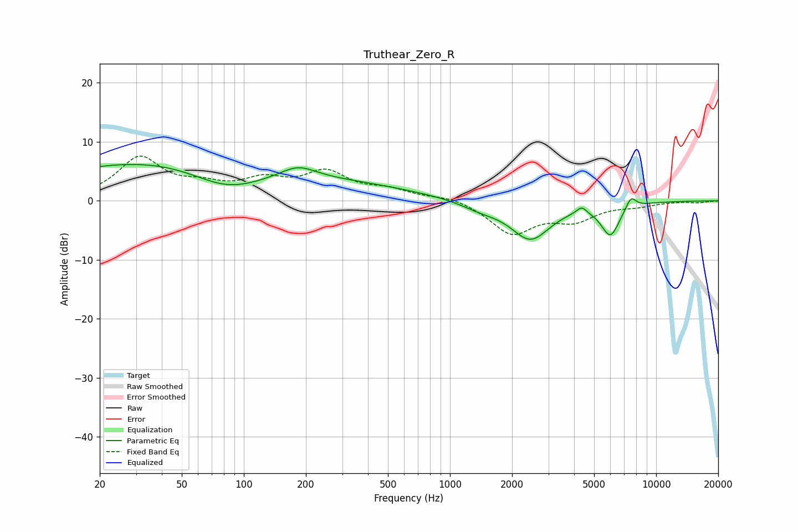

# Truthear_Zero_R
See [usage instructions](https://github.com/jaakkopasanen/AutoEq#usage) for more options and info.

### Parametric EQs
Apply preamp of -6.2 dB when using parametric equalizer.

|   # | Type    |   Fc (Hz) |    Q |   Gain (dB) |
|-----|---------|-----------|------|-------------|
|   1 | Peaking |        25 | 0.31 |         5.1 |
|   2 | Peaking |        83 | 0.81 |        -3.8 |
|   3 | Peaking |       142 | 0.23 |         3.9 |
|   4 | Peaking |       183 | 1.64 |         2.1 |
|   5 | Peaking |      1403 | 1.45 |        -1.2 |
|   6 | Peaking |      2457 | 1.45 |        -6.4 |
|   7 | Peaking |      4272 | 4.6  |         0.1 |
|   8 | Peaking |      4358 | 6    |         1.1 |
|   9 | Peaking |      5997 | 3.03 |        -5.4 |
|  10 | Peaking |      7544 | 5.49 |         2   |

### Fixed Band EQs
When using fixed band (also called graphic) equalizer, apply preamp of **-7.7 dB** (if available) and set gains manually with these parameters.

|   # | Type    |   Fc (Hz) |    Q |   Gain (dB) |
|-----|---------|-----------|------|-------------|
|   1 | Peaking |        31 | 1.41 |         7.1 |
|   2 | Peaking |        62 | 1.41 |         1.9 |
|   3 | Peaking |       125 | 1.41 |         2.9 |
|   4 | Peaking |       250 | 1.41 |         4.4 |
|   5 | Peaking |       500 | 1.41 |         1.6 |
|   6 | Peaking |      1000 | 1.41 |         0.8 |
|   7 | Peaking |      2000 | 1.41 |        -5.4 |
|   8 | Peaking |      4000 | 1.41 |        -2.9 |
|   9 | Peaking |      8000 | 1.41 |        -0.7 |
|  10 | Peaking |     16000 | 1.41 |        -0.3 |

### Graphs

