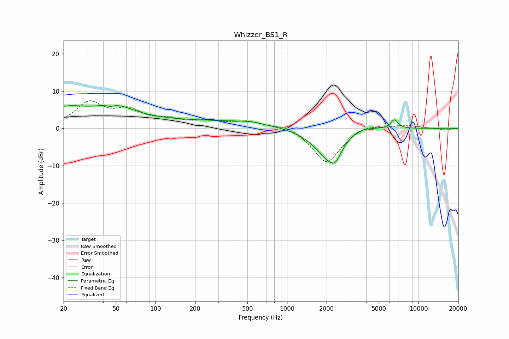

# Whizzer_BS1_R
See [usage instructions](https://github.com/jaakkopasanen/AutoEq#usage) for more options and info.

### Parametric EQs
Apply preamp of -6.2 dB when using parametric equalizer.

|   # | Type    |   Fc (Hz) |    Q |   Gain (dB) |
|-----|---------|-----------|------|-------------|
|   1 | Peaking |        20 | 0.87 |         4.5 |
|   2 | Peaking |        45 | 5.6  |        -0.6 |
|   3 | Peaking |        49 | 0.93 |         3.8 |
|   4 | Peaking |       185 | 0.19 |         2   |
|   5 | Peaking |       495 | 1.45 |         0.4 |
|   6 | Peaking |       565 | 5.16 |         0.1 |
|   7 | Peaking |      2111 | 1.27 |        -8.8 |
|   8 | Peaking |      2334 | 3.8  |        -2.3 |
|   9 | Peaking |      3432 | 1.2  |         2.2 |
|  10 | Peaking |      6556 | 4.95 |         2.4 |

### Fixed Band EQs
When using fixed band (also called graphic) equalizer, apply preamp of **-7.5 dB** (if available) and set gains manually with these parameters.

|   # | Type    |   Fc (Hz) |    Q |   Gain (dB) |
|-----|---------|-----------|------|-------------|
|   1 | Peaking |        31 | 1.41 |         6.5 |
|   2 | Peaking |        62 | 1.41 |         4.1 |
|   3 | Peaking |       125 | 1.41 |         1.8 |
|   4 | Peaking |       250 | 1.41 |         1.6 |
|   5 | Peaking |       500 | 1.41 |         1.7 |
|   6 | Peaking |      1000 | 1.41 |         1.2 |
|   7 | Peaking |      2000 | 1.41 |        -9.5 |
|   8 | Peaking |      4000 | 1.41 |         1.5 |
|   9 | Peaking |      8000 | 1.41 |         0.9 |
|  10 | Peaking |     16000 | 1.41 |        -0.5 |

### Graphs

