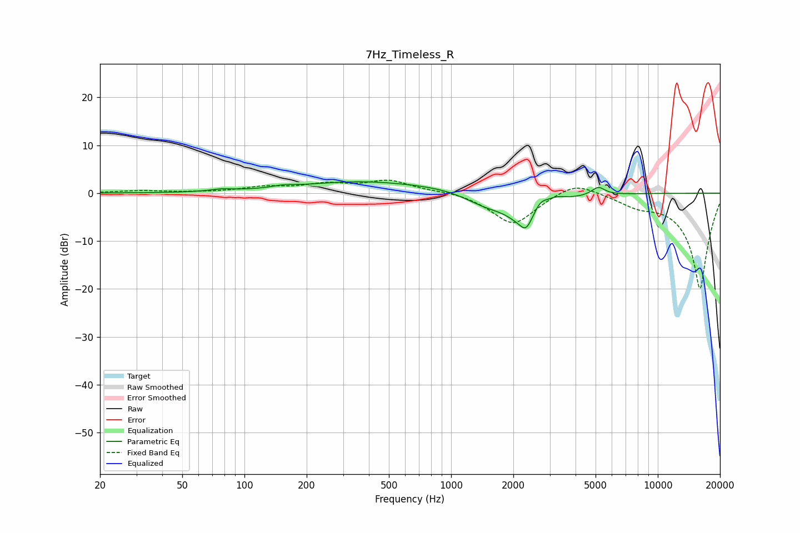

# 7Hz_Timeless_R
See [usage instructions](https://github.com/jaakkopasanen/AutoEq#usage) for more options and info.

### Parametric EQs
Apply preamp of -2.5 dB when using parametric equalizer.

|   # | Type    |   Fc (Hz) |    Q |   Gain (dB) |
|-----|---------|-----------|------|-------------|
|   1 | Peaking |        78 | 2.61 |         0.4 |
|   2 | Peaking |       154 | 2.81 |         0.4 |
|   3 | Peaking |       367 | 0.47 |         2.4 |
|   4 | Peaking |       909 | 0.96 |         0.5 |
|   5 | Peaking |      1458 | 1.38 |        -2.1 |
|   6 | Peaking |      2300 | 6    |        -1.5 |
|   7 | Peaking |      2352 | 1.69 |        -7.3 |
|   8 | Peaking |      2679 | 3.38 |         3.7 |
|   9 | Peaking |      3238 | 3.24 |         1.2 |
|  10 | Peaking |      5152 | 4.48 |         1.7 |

### Fixed Band EQs
When using fixed band (also called graphic) equalizer, apply preamp of **-2.8 dB** (if available) and set gains manually with these parameters.

|   # | Type    |   Fc (Hz) |    Q |   Gain (dB) |
|-----|---------|-----------|------|-------------|
|   1 | Peaking |        31 | 1.41 |         0.5 |
|   2 | Peaking |        62 | 1.41 |         0.1 |
|   3 | Peaking |       125 | 1.41 |         1.1 |
|   4 | Peaking |       250 | 1.41 |         1.6 |
|   5 | Peaking |       500 | 1.41 |         2.5 |
|   6 | Peaking |      1000 | 1.41 |         0.5 |
|   7 | Peaking |      2000 | 1.41 |        -6.7 |
|   8 | Peaking |      4000 | 1.41 |         2.8 |
|   9 | Peaking |      8000 | 1.41 |        -1.9 |
|  10 | Peaking |     16000 | 1.41 |       -20   |

### Graphs

