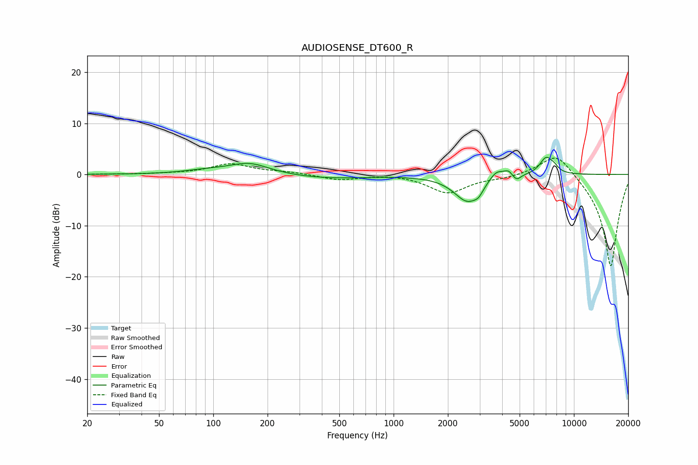

# AUDIOSENSE_DT600_R
See [usage instructions](https://github.com/jaakkopasanen/AutoEq#usage) for more options and info.

### Parametric EQs
Apply preamp of -3.4 dB when using parametric equalizer.

|   # | Type    |   Fc (Hz) |    Q |   Gain (dB) |
|-----|---------|-----------|------|-------------|
|   1 | Peaking |        92 | 1.12 |         0.6 |
|   2 | Peaking |       159 | 1.26 |         2.2 |
|   3 | Peaking |       426 | 0.58 |        -0.8 |
|   4 | Peaking |      2576 | 1.88 |        -5.2 |
|   5 | Peaking |      2960 | 5.82 |        -1   |
|   6 | Peaking |      3718 | 3.43 |         1.9 |
|   7 | Peaking |      4337 | 5.99 |         1.1 |
|   8 | Peaking |      4804 | 6    |        -1.2 |
|   9 | Peaking |      7015 | 3.79 |         3.3 |
|  10 | Peaking |      7779 | 6    |         0.8 |

### Fixed Band EQs
When using fixed band (also called graphic) equalizer, apply preamp of **-3.3 dB** (if available) and set gains manually with these parameters.

|   # | Type    |   Fc (Hz) |    Q |   Gain (dB) |
|-----|---------|-----------|------|-------------|
|   1 | Peaking |        31 | 1.41 |         0   |
|   2 | Peaking |        62 | 1.41 |         0.1 |
|   3 | Peaking |       125 | 1.41 |         2   |
|   4 | Peaking |       250 | 1.41 |         0.4 |
|   5 | Peaking |       500 | 1.41 |        -1.1 |
|   6 | Peaking |      1000 | 1.41 |         0.2 |
|   7 | Peaking |      2000 | 1.41 |        -3.6 |
|   8 | Peaking |      4000 | 1.41 |        -0.5 |
|   9 | Peaking |      8000 | 1.41 |         4.8 |
|  10 | Peaking |     16000 | 1.41 |       -18.3 |

### Graphs

