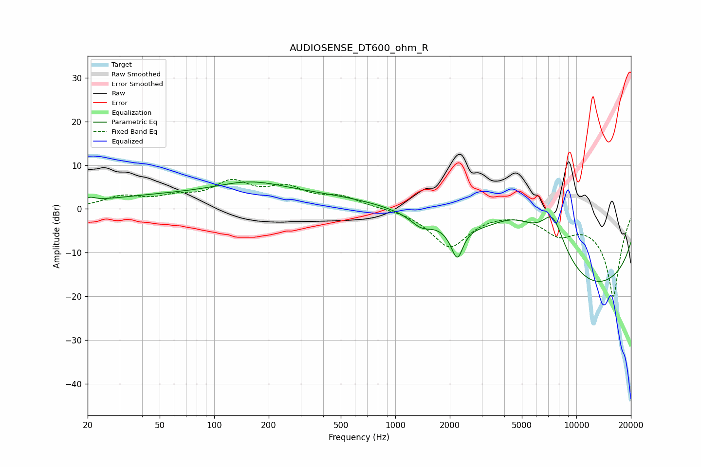

# AUDIOSENSE_DT600_ohm_R
See [usage instructions](https://github.com/jaakkopasanen/AutoEq#usage) for more options and info.

### Parametric EQs
Apply preamp of -6.3 dB when using parametric equalizer.

|   # | Type    |   Fc (Hz) |    Q |   Gain (dB) |
|-----|---------|-----------|------|-------------|
|   1 | Peaking |        21 | 5.01 |         0.8 |
|   2 | Peaking |       102 | 0.2  |         3.4 |
|   3 | Peaking |       160 | 0.78 |         2.6 |
|   4 | Peaking |      1388 | 2.45 |        -2.3 |
|   5 | Peaking |      1437 | 0.29 |         3.6 |
|   6 | Peaking |      2203 | 3.9  |        -8.3 |
|   7 | Peaking |      2368 | 2.98 |         1   |
|   8 | Peaking |      4581 | 0.85 |         8.9 |
|   9 | Peaking |      7415 | 1.71 |        11.5 |
|  10 | Peaking |     10000 | 0.18 |       -20   |

### Fixed Band EQs
When using fixed band (also called graphic) equalizer, apply preamp of **-6.8 dB** (if available) and set gains manually with these parameters.

|   # | Type    |   Fc (Hz) |    Q |   Gain (dB) |
|-----|---------|-----------|------|-------------|
|   1 | Peaking |        31 | 1.41 |         2.5 |
|   2 | Peaking |        62 | 1.41 |         2   |
|   3 | Peaking |       125 | 1.41 |         5.4 |
|   4 | Peaking |       250 | 1.41 |         4.1 |
|   5 | Peaking |       500 | 1.41 |         2.5 |
|   6 | Peaking |      1000 | 1.41 |         0.2 |
|   7 | Peaking |      2000 | 1.41 |        -8.6 |
|   8 | Peaking |      4000 | 1.41 |         0.1 |
|   9 | Peaking |      8000 | 1.41 |        -4.5 |
|  10 | Peaking |     16000 | 1.41 |       -20   |

### Graphs

