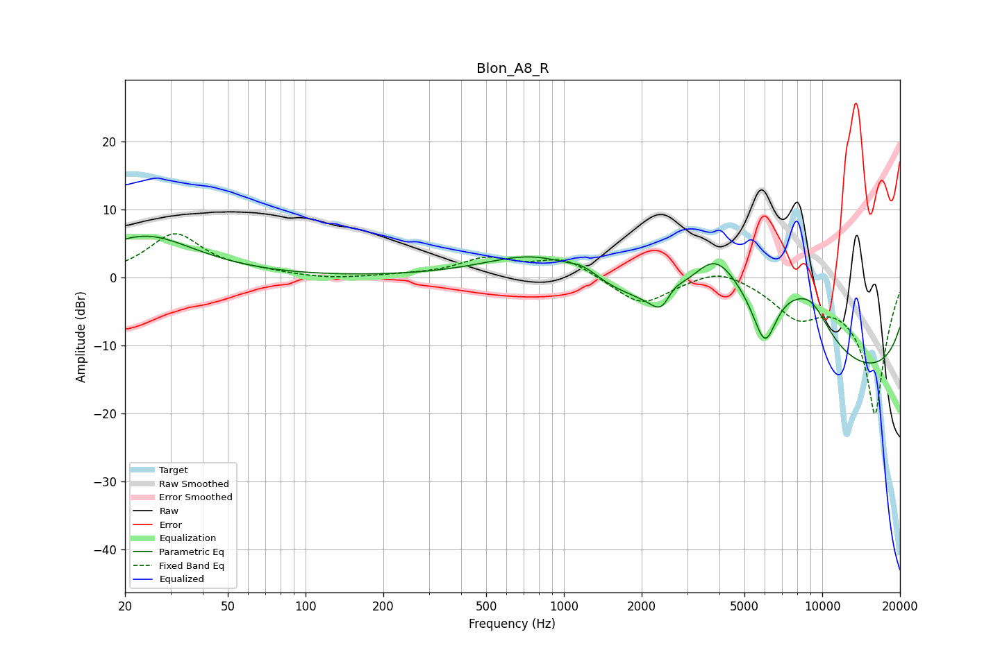

# Blon_A8_R
See [usage instructions](https://github.com/jaakkopasanen/AutoEq#usage) for more options and info.

### Parametric EQs
Apply preamp of -6.2 dB when using parametric equalizer.

|   # | Type    |   Fc (Hz) |    Q |   Gain (dB) |
|-----|---------|-----------|------|-------------|
|   1 | Peaking |        24 | 0.72 |         6.1 |
|   2 | Peaking |       806 | 0.7  |         5.3 |
|   3 | Peaking |      1189 | 2.39 |         1.4 |
|   4 | Peaking |      2431 | 3.09 |        -4.8 |
|   5 | Peaking |      2593 | 3.24 |         3.2 |
|   6 | Peaking |      3846 | 1.33 |         8.2 |
|   7 | Peaking |      6005 | 2.65 |        -9.7 |
|   8 | Peaking |      6921 | 0.57 |        15.5 |
|   9 | Peaking |      9107 | 1.81 |         3.8 |
|  10 | Peaking |     10000 | 0.18 |       -20   |

### Fixed Band EQs
When using fixed band (also called graphic) equalizer, apply preamp of **-6.5 dB** (if available) and set gains manually with these parameters.

|   # | Type    |   Fc (Hz) |    Q |   Gain (dB) |
|-----|---------|-----------|------|-------------|
|   1 | Peaking |        31 | 1.41 |         6.3 |
|   2 | Peaking |        62 | 1.41 |         0.6 |
|   3 | Peaking |       125 | 1.41 |        -0.4 |
|   4 | Peaking |       250 | 1.41 |         0.2 |
|   5 | Peaking |       500 | 1.41 |         2.6 |
|   6 | Peaking |      1000 | 1.41 |         2.8 |
|   7 | Peaking |      2000 | 1.41 |        -4.2 |
|   8 | Peaking |      4000 | 1.41 |         1.9 |
|   9 | Peaking |      8000 | 1.41 |        -4.7 |
|  10 | Peaking |     16000 | 1.41 |       -20   |

### Graphs

