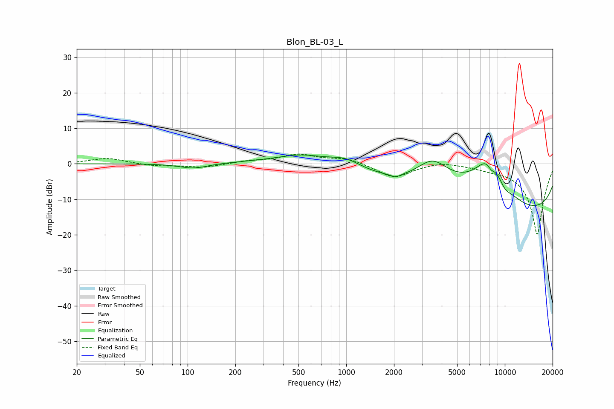

# Blon_BL-03_L
See [usage instructions](https://github.com/jaakkopasanen/AutoEq#usage) for more options and info.

### Parametric EQs
Apply preamp of -2.6 dB when using parametric equalizer.

|   # | Type    |   Fc (Hz) |    Q |   Gain (dB) |
|-----|---------|-----------|------|-------------|
|   1 | Peaking |       109 | 1.61 |        -1.4 |
|   2 | Peaking |       517 | 1.13 |         1.5 |
|   3 | Peaking |       722 | 0.42 |         2.1 |
|   4 | Peaking |       991 | 1.45 |         2.3 |
|   5 | Peaking |      2052 | 5.34 |        -0.9 |
|   6 | Peaking |      3503 | 1.2  |         8.7 |
|   7 | Peaking |      7988 | 0.96 |        18.1 |
|   8 | Peaking |      8191 | 4.89 |        -2.7 |
|   9 | Peaking |      9711 | 0.18 |       -18   |
|  10 | Peaking |     10000 | 3.35 |        -1.9 |

### Fixed Band EQs
When using fixed band (also called graphic) equalizer, apply preamp of **-2.8 dB** (if available) and set gains manually with these parameters.

|   # | Type    |   Fc (Hz) |    Q |   Gain (dB) |
|-----|---------|-----------|------|-------------|
|   1 | Peaking |        31 | 1.41 |         1.6 |
|   2 | Peaking |        62 | 1.41 |        -0.6 |
|   3 | Peaking |       125 | 1.41 |        -1.1 |
|   4 | Peaking |       250 | 1.41 |         0.7 |
|   5 | Peaking |       500 | 1.41 |         2.5 |
|   6 | Peaking |      1000 | 1.41 |         1.6 |
|   7 | Peaking |      2000 | 1.41 |        -4   |
|   8 | Peaking |      4000 | 1.41 |         0.9 |
|   9 | Peaking |      8000 | 1.41 |        -0.8 |
|  10 | Peaking |     16000 | 1.41 |       -20   |

### Graphs

