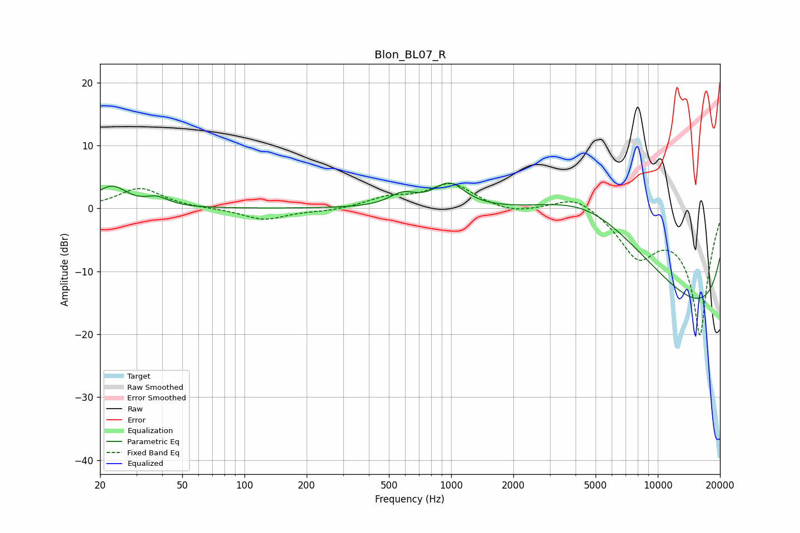

# Blon_BL07_R
See [usage instructions](https://github.com/jaakkopasanen/AutoEq#usage) for more options and info.

### Parametric EQs
Apply preamp of -4.2 dB when using parametric equalizer.

|   # | Type    |   Fc (Hz) |    Q |   Gain (dB) |
|-----|---------|-----------|------|-------------|
|   1 | Peaking |        20 | 2.99 |         0.6 |
|   2 | Peaking |        23 | 2.17 |         2.9 |
|   3 | Peaking |        27 | 3.66 |         0.2 |
|   4 | Peaking |        38 | 2.44 |         1.4 |
|   5 | Peaking |       582 | 2.16 |         1.9 |
|   6 | Peaking |       982 | 1.89 |         3.8 |
|   7 | Peaking |      4516 | 0.36 |        13.4 |
|   8 | Peaking |      6942 | 0.37 |         5.3 |
|   9 | Peaking |     10000 | 0.18 |        -4.8 |
|  10 | Peaking |     10000 | 0.18 |       -17.7 |

### Fixed Band EQs
When using fixed band (also called graphic) equalizer, apply preamp of **-4.1 dB** (if available) and set gains manually with these parameters.

|   # | Type    |   Fc (Hz) |    Q |   Gain (dB) |
|-----|---------|-----------|------|-------------|
|   1 | Peaking |        31 | 1.41 |         3.2 |
|   2 | Peaking |        62 | 1.41 |        -0   |
|   3 | Peaking |       125 | 1.41 |        -1.8 |
|   4 | Peaking |       250 | 1.41 |        -0.4 |
|   5 | Peaking |       500 | 1.41 |         1.5 |
|   6 | Peaking |      1000 | 1.41 |         3.8 |
|   7 | Peaking |      2000 | 1.41 |        -0.9 |
|   8 | Peaking |      4000 | 1.41 |         2.4 |
|   9 | Peaking |      8000 | 1.41 |        -6.7 |
|  10 | Peaking |     16000 | 1.41 |       -20   |

### Graphs

