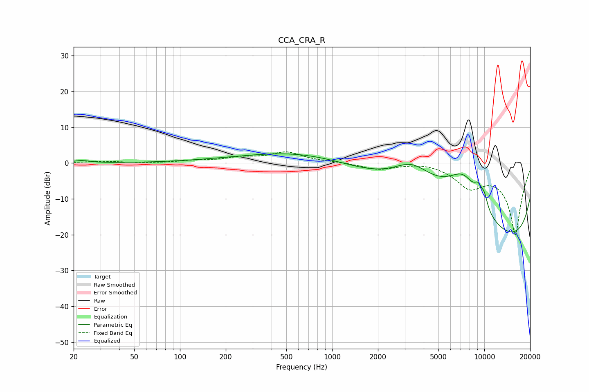

# CCA_CRA_R
See [usage instructions](https://github.com/jaakkopasanen/AutoEq#usage) for more options and info.

### Parametric EQs
Apply preamp of -2.7 dB when using parametric equalizer.

|   # | Type    |   Fc (Hz) |    Q |   Gain (dB) |
|-----|---------|-----------|------|-------------|
|   1 | Peaking |        22 | 2.69 |         0.6 |
|   2 | Peaking |       368 | 0.37 |         1.3 |
|   3 | Peaking |      2993 | 0.18 |         8.2 |
|   4 | Peaking |      3343 | 1.02 |         7.4 |
|   5 | Peaking |      4947 | 5.09 |         0   |
|   6 | Peaking |      7297 | 0.67 |        19.8 |
|   7 | Peaking |      8972 | 0.18 |       -16.9 |
|   8 | Peaking |      9115 | 4.99 |         3.4 |
|   9 | Peaking |      9284 | 0.18 |       -15.9 |
|  10 | Peaking |     10000 | 5.74 |         3.4 |

### Fixed Band EQs
When using fixed band (also called graphic) equalizer, apply preamp of **-3.2 dB** (if available) and set gains manually with these parameters.

|   # | Type    |   Fc (Hz) |    Q |   Gain (dB) |
|-----|---------|-----------|------|-------------|
|   1 | Peaking |        31 | 1.41 |         0.5 |
|   2 | Peaking |        62 | 1.41 |        -0.1 |
|   3 | Peaking |       125 | 1.41 |         0.6 |
|   4 | Peaking |       250 | 1.41 |         1.3 |
|   5 | Peaking |       500 | 1.41 |         2.9 |
|   6 | Peaking |      1000 | 1.41 |         0.3 |
|   7 | Peaking |      2000 | 1.41 |        -1.7 |
|   8 | Peaking |      4000 | 1.41 |         0.5 |
|   9 | Peaking |      8000 | 1.41 |        -5.7 |
|  10 | Peaking |     16000 | 1.41 |       -20   |

### Graphs

