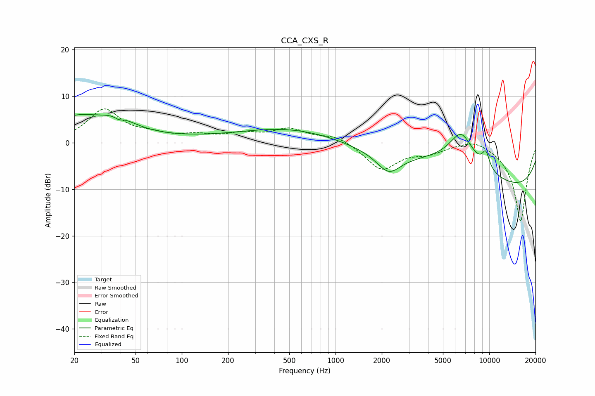

# CCA_CXS_R
See [usage instructions](https://github.com/jaakkopasanen/AutoEq#usage) for more options and info.

### Parametric EQs
Apply preamp of -6.2 dB when using parametric equalizer.

|   # | Type    |   Fc (Hz) |    Q |   Gain (dB) |
|-----|---------|-----------|------|-------------|
|   1 | Peaking |        20 | 0.86 |         4.4 |
|   2 | Peaking |        38 | 1.17 |         2.9 |
|   3 | Peaking |        39 | 5.64 |        -0.7 |
|   4 | Peaking |        49 | 0.34 |         0.9 |
|   5 | Peaking |       513 | 0.41 |         3.2 |
|   6 | Peaking |      2215 | 1.85 |        -4.1 |
|   7 | Peaking |      5779 | 0.44 |         5.9 |
|   8 | Peaking |      6575 | 1.77 |         6.7 |
|   9 | Peaking |      9504 | 5.19 |         3.5 |
|  10 | Peaking |     10000 | 0.18 |       -11.4 |

### Fixed Band EQs
When using fixed band (also called graphic) equalizer, apply preamp of **-7.4 dB** (if available) and set gains manually with these parameters.

|   # | Type    |   Fc (Hz) |    Q |   Gain (dB) |
|-----|---------|-----------|------|-------------|
|   1 | Peaking |        31 | 1.41 |         6.9 |
|   2 | Peaking |        62 | 1.41 |         1.3 |
|   3 | Peaking |       125 | 1.41 |         1.3 |
|   4 | Peaking |       250 | 1.41 |         1.6 |
|   5 | Peaking |       500 | 1.41 |         2.7 |
|   6 | Peaking |      1000 | 1.41 |         1.6 |
|   7 | Peaking |      2000 | 1.41 |        -5.7 |
|   8 | Peaking |      4000 | 1.41 |        -1.8 |
|   9 | Peaking |      8000 | 1.41 |         1.4 |
|  10 | Peaking |     16000 | 1.41 |       -17   |

### Graphs

