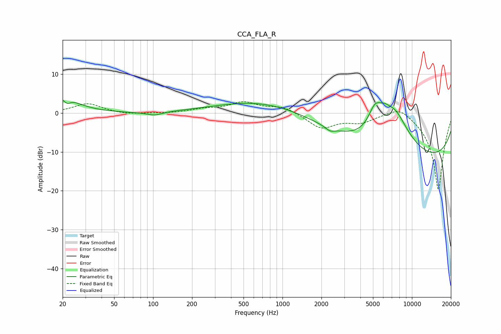

# CCA_FLA_R
See [usage instructions](https://github.com/jaakkopasanen/AutoEq#usage) for more options and info.

### Parametric EQs
Apply preamp of -3.4 dB when using parametric equalizer.

|   # | Type    |   Fc (Hz) |    Q |   Gain (dB) |
|-----|---------|-----------|------|-------------|
|   1 | Peaking |        20 | 1.22 |         4   |
|   2 | Peaking |        22 | 5.96 |        -1.3 |
|   3 | Peaking |        84 | 1.22 |        -0.1 |
|   4 | Peaking |       103 | 2.45 |        -0.9 |
|   5 | Peaking |       799 | 0.37 |         3.7 |
|   6 | Peaking |      2332 | 4.1  |        -1   |
|   7 | Peaking |      5184 | 2.63 |         5.7 |
|   8 | Peaking |      6101 | 3.32 |         1.7 |
|   9 | Peaking |      7297 | 1.04 |        11.7 |
|  10 | Peaking |     10000 | 0.18 |       -13   |

### Fixed Band EQs
When using fixed band (also called graphic) equalizer, apply preamp of **-3.0 dB** (if available) and set gains manually with these parameters.

|   # | Type    |   Fc (Hz) |    Q |   Gain (dB) |
|-----|---------|-----------|------|-------------|
|   1 | Peaking |        31 | 1.41 |         2.5 |
|   2 | Peaking |        62 | 1.41 |        -0.4 |
|   3 | Peaking |       125 | 1.41 |        -0.1 |
|   4 | Peaking |       250 | 1.41 |         0.9 |
|   5 | Peaking |       500 | 1.41 |         2.6 |
|   6 | Peaking |      1000 | 1.41 |         1.7 |
|   7 | Peaking |      2000 | 1.41 |        -3.8 |
|   8 | Peaking |      4000 | 1.41 |        -2.1 |
|   9 | Peaking |      8000 | 1.41 |         2.5 |
|  10 | Peaking |     16000 | 1.41 |       -20   |

### Graphs

