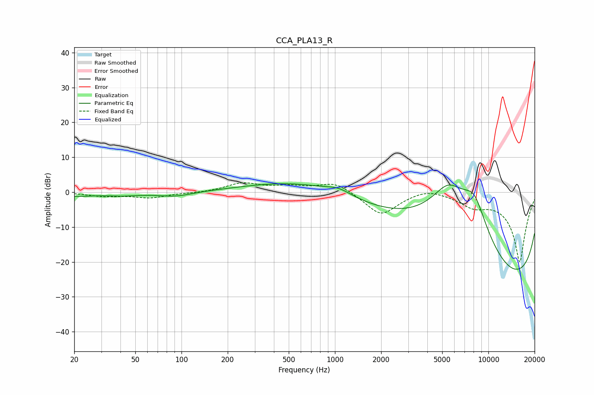

# CCA_PLA13_R
See [usage instructions](https://github.com/jaakkopasanen/AutoEq#usage) for more options and info.

### Parametric EQs
Apply preamp of -2.5 dB when using parametric equalizer.

|   # | Type    |   Fc (Hz) |    Q |   Gain (dB) |
|-----|---------|-----------|------|-------------|
|   1 | Peaking |        20 | 1.21 |        -1   |
|   2 | Peaking |        37 | 2.42 |         0   |
|   3 | Peaking |        41 | 1.25 |        -0.8 |
|   4 | Peaking |        91 | 1.25 |        -1.3 |
|   5 | Peaking |      1059 | 1.74 |         1.7 |
|   6 | Peaking |      2054 | 0.18 |         8.3 |
|   7 | Peaking |      5463 | 0.79 |        16.9 |
|   8 | Peaking |      8077 | 0.86 |        20   |
|   9 | Peaking |      8352 | 0.18 |       -17.1 |
|  10 | Peaking |     10000 | 0.18 |       -19.7 |

### Fixed Band EQs
When using fixed band (also called graphic) equalizer, apply preamp of **-2.8 dB** (if available) and set gains manually with these parameters.

|   # | Type    |   Fc (Hz) |    Q |   Gain (dB) |
|-----|---------|-----------|------|-------------|
|   1 | Peaking |        31 | 1.41 |        -1   |
|   2 | Peaking |        62 | 1.41 |        -1.5 |
|   3 | Peaking |       125 | 1.41 |        -0.2 |
|   4 | Peaking |       250 | 1.41 |         2.5 |
|   5 | Peaking |       500 | 1.41 |         1.4 |
|   6 | Peaking |      1000 | 1.41 |         3   |
|   7 | Peaking |      2000 | 1.41 |        -6.7 |
|   8 | Peaking |      4000 | 1.41 |         1.5 |
|   9 | Peaking |      8000 | 1.41 |        -3.2 |
|  10 | Peaking |     16000 | 1.41 |       -20   |

### Graphs

