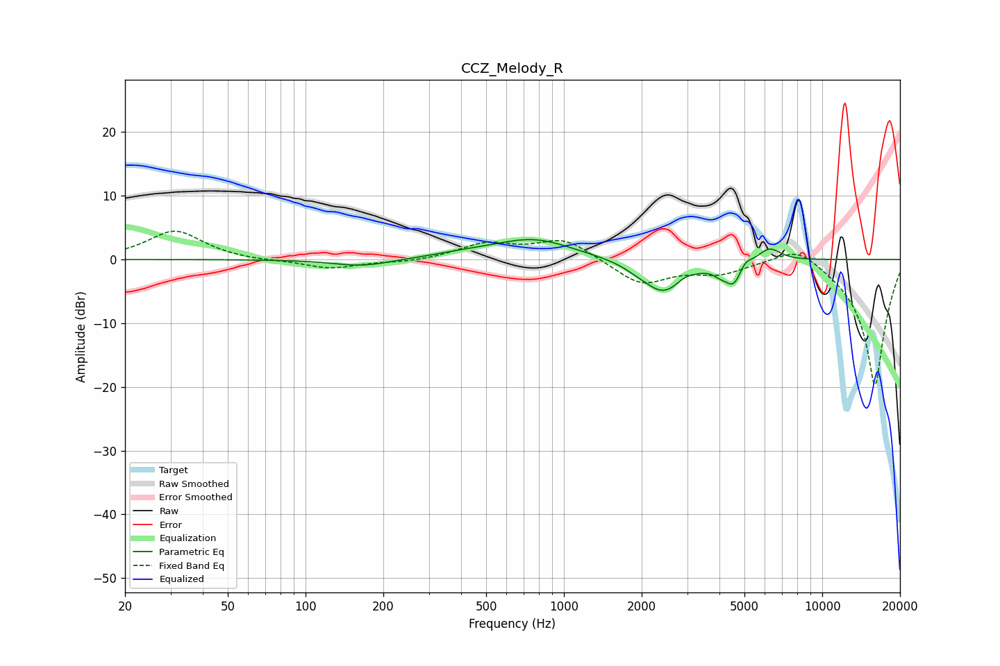

# CCZ_Melody_R
See [usage instructions](https://github.com/jaakkopasanen/AutoEq#usage) for more options and info.

### Parametric EQs
Apply preamp of -3.2 dB when using parametric equalizer.

|   # | Type    |   Fc (Hz) |    Q |   Gain (dB) |
|-----|---------|-----------|------|-------------|
|   1 | Peaking |       166 | 1.26 |        -1.1 |
|   2 | Peaking |       407 | 1.16 |         0.5 |
|   3 | Peaking |       761 | 0.92 |         3.2 |
|   4 | Peaking |      1908 | 3.18 |        -0.4 |
|   5 | Peaking |      2423 | 1.76 |        -5.2 |
|   6 | Peaking |      2923 | 4.62 |         0.6 |
|   7 | Peaking |      4022 | 5.16 |        -0.9 |
|   8 | Peaking |      4541 | 4.27 |        -3.5 |
|   9 | Peaking |      5023 | 6    |         1.2 |
|  10 | Peaking |      6246 | 3.19 |         2.1 |

### Fixed Band EQs
When using fixed band (also called graphic) equalizer, apply preamp of **-4.5 dB** (if available) and set gains manually with these parameters.

|   # | Type    |   Fc (Hz) |    Q |   Gain (dB) |
|-----|---------|-----------|------|-------------|
|   1 | Peaking |        31 | 1.41 |         4.5 |
|   2 | Peaking |        62 | 1.41 |        -0.3 |
|   3 | Peaking |       125 | 1.41 |        -1.4 |
|   4 | Peaking |       250 | 1.41 |        -0.4 |
|   5 | Peaking |       500 | 1.41 |         2.4 |
|   6 | Peaking |      1000 | 1.41 |         3.2 |
|   7 | Peaking |      2000 | 1.41 |        -3.9 |
|   8 | Peaking |      4000 | 1.41 |        -1.9 |
|   9 | Peaking |      8000 | 1.41 |         2.9 |
|  10 | Peaking |     16000 | 1.41 |       -20   |

### Graphs

