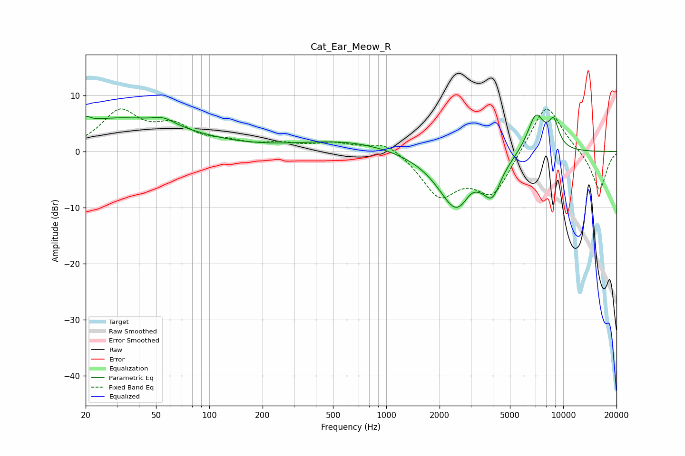

# Cat_Ear_Meow_R
See [usage instructions](https://github.com/jaakkopasanen/AutoEq#usage) for more options and info.

### Parametric EQs
Apply preamp of -6.6 dB when using parametric equalizer.

|   # | Type    |   Fc (Hz) |    Q |   Gain (dB) |
|-----|---------|-----------|------|-------------|
|   1 | Peaking |        20 | 5.59 |         1   |
|   2 | Peaking |        31 | 0.37 |         5.8 |
|   3 | Peaking |        55 | 2.39 |         1.1 |
|   4 | Peaking |       589 | 0.51 |         1.9 |
|   5 | Peaking |      2483 | 1.32 |       -10.2 |
|   6 | Peaking |      3022 | 3.84 |         1.1 |
|   7 | Peaking |      3919 | 2.39 |        -0.6 |
|   8 | Peaking |      3975 | 2.95 |        -4.7 |
|   9 | Peaking |      7000 | 2.67 |         7   |
|  10 | Peaking |      8832 | 4.29 |         4.5 |

### Fixed Band EQs
When using fixed band (also called graphic) equalizer, apply preamp of **-7.7 dB** (if available) and set gains manually with these parameters.

|   # | Type    |   Fc (Hz) |    Q |   Gain (dB) |
|-----|---------|-----------|------|-------------|
|   1 | Peaking |        31 | 1.41 |         6.8 |
|   2 | Peaking |        62 | 1.41 |         3.9 |
|   3 | Peaking |       125 | 1.41 |         1.3 |
|   4 | Peaking |       250 | 1.41 |         1.1 |
|   5 | Peaking |       500 | 1.41 |         1.3 |
|   6 | Peaking |      1000 | 1.41 |         2.1 |
|   7 | Peaking |      2000 | 1.41 |        -7.5 |
|   8 | Peaking |      4000 | 1.41 |        -7.6 |
|   9 | Peaking |      8000 | 1.41 |         9.3 |
|  10 | Peaking |     16000 | 1.41 |        -7.2 |

### Graphs

