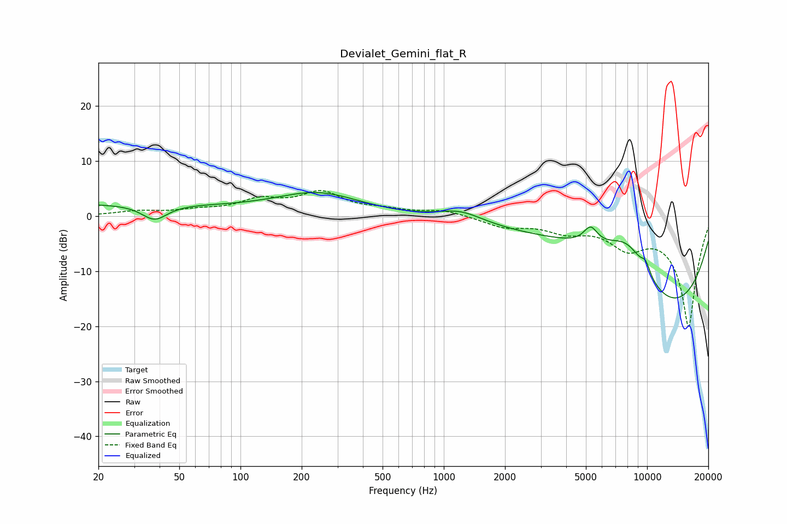

# Devialet_Gemini_flat_R
See [usage instructions](https://github.com/jaakkopasanen/AutoEq#usage) for more options and info.

### Parametric EQs
Apply preamp of -4.4 dB when using parametric equalizer.

|   # | Type    |   Fc (Hz) |    Q |   Gain (dB) |
|-----|---------|-----------|------|-------------|
|   1 | Peaking |        20 | 0.19 |         2.2 |
|   2 | Peaking |        38 | 2.29 |        -2.8 |
|   3 | Peaking |       241 | 0.67 |         4   |
|   4 | Peaking |      1206 | 1.26 |         2.1 |
|   5 | Peaking |      4848 | 0.38 |        10.3 |
|   6 | Peaking |      5272 | 4    |         3.1 |
|   7 | Peaking |      8014 | 0.91 |        11.4 |
|   8 | Peaking |      8613 | 0.22 |       -15.2 |
|   9 | Peaking |      9683 | 0.35 |       -10.4 |
|  10 | Peaking |      9853 | 5.51 |         2   |

### Fixed Band EQs
When using fixed band (also called graphic) equalizer, apply preamp of **-4.7 dB** (if available) and set gains manually with these parameters.

|   # | Type    |   Fc (Hz) |    Q |   Gain (dB) |
|-----|---------|-----------|------|-------------|
|   1 | Peaking |        31 | 1.41 |         0.8 |
|   2 | Peaking |        62 | 1.41 |         0.8 |
|   3 | Peaking |       125 | 1.41 |         2.6 |
|   4 | Peaking |       250 | 1.41 |         4   |
|   5 | Peaking |       500 | 1.41 |         0.9 |
|   6 | Peaking |      1000 | 1.41 |         1   |
|   7 | Peaking |      2000 | 1.41 |        -1.8 |
|   8 | Peaking |      4000 | 1.41 |        -2.3 |
|   9 | Peaking |      8000 | 1.41 |        -4.5 |
|  10 | Peaking |     16000 | 1.41 |       -20   |

### Graphs

