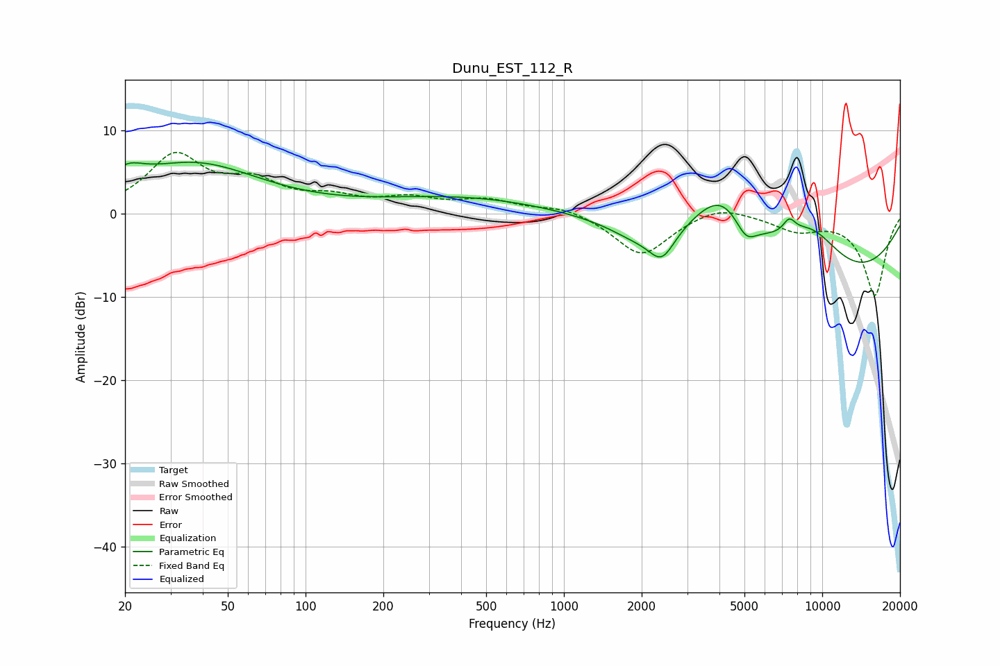

# Dunu_EST_112_R
See [usage instructions](https://github.com/jaakkopasanen/AutoEq#usage) for more options and info.

### Parametric EQs
Apply preamp of -6.2 dB when using parametric equalizer.

|   # | Type    |   Fc (Hz) |    Q |   Gain (dB) |
|-----|---------|-----------|------|-------------|
|   1 | Peaking |        20 | 2.26 |         2   |
|   2 | Peaking |        37 | 0.55 |         5.8 |
|   3 | Peaking |       407 | 0.42 |         2   |
|   4 | Peaking |      1891 | 1.39 |        -1.5 |
|   5 | Peaking |      2394 | 2.78 |        -3.6 |
|   6 | Peaking |      4098 | 1.07 |         7.8 |
|   7 | Peaking |      5061 | 3.26 |        -2.6 |
|   8 | Peaking |      7450 | 5.55 |         1.6 |
|   9 | Peaking |      9020 | 0.96 |         6.7 |
|  10 | Peaking |      9102 | 0.28 |       -10   |

### Fixed Band EQs
When using fixed band (also called graphic) equalizer, apply preamp of **-7.4 dB** (if available) and set gains manually with these parameters.

|   # | Type    |   Fc (Hz) |    Q |   Gain (dB) |
|-----|---------|-----------|------|-------------|
|   1 | Peaking |        31 | 1.41 |         6.7 |
|   2 | Peaking |        62 | 1.41 |         3.2 |
|   3 | Peaking |       125 | 1.41 |         1.5 |
|   4 | Peaking |       250 | 1.41 |         1.5 |
|   5 | Peaking |       500 | 1.41 |         1.5 |
|   6 | Peaking |      1000 | 1.41 |         0.9 |
|   7 | Peaking |      2000 | 1.41 |        -5.1 |
|   8 | Peaking |      4000 | 1.41 |         1.3 |
|   9 | Peaking |      8000 | 1.41 |        -1.8 |
|  10 | Peaking |     16000 | 1.41 |        -9.8 |

### Graphs

