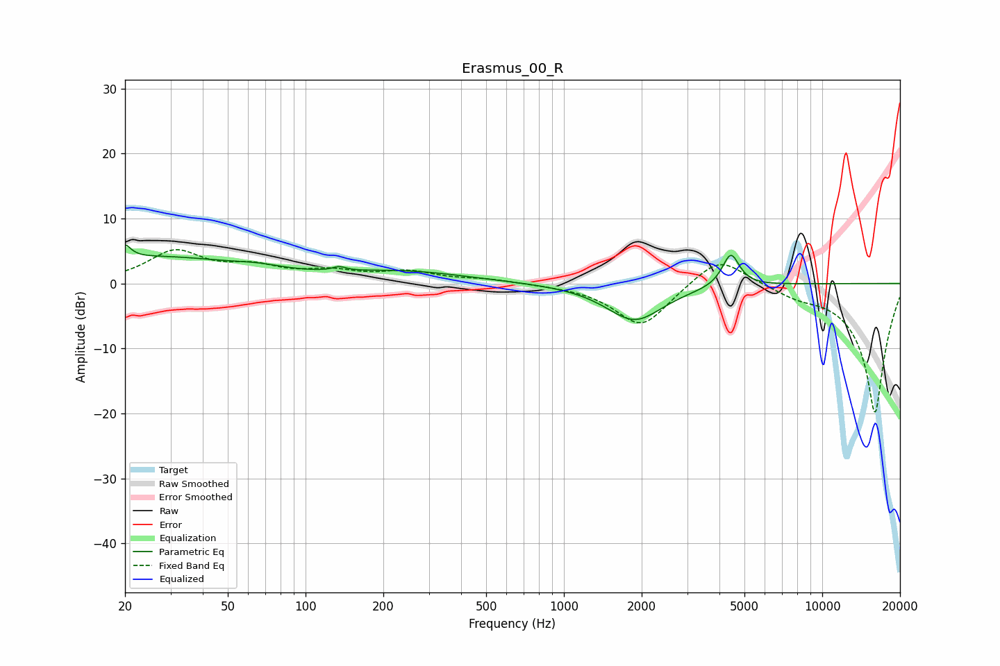

# Erasmus_00_R
See [usage instructions](https://github.com/jaakkopasanen/AutoEq#usage) for more options and info.

### Parametric EQs
Apply preamp of -6.0 dB when using parametric equalizer.

|   # | Type    |   Fc (Hz) |    Q |   Gain (dB) |
|-----|---------|-----------|------|-------------|
|   1 | Peaking |        20 | 6    |         4.5 |
|   2 | Peaking |        20 | 6    |        -2.4 |
|   3 | Peaking |        26 | 0.42 |         3.9 |
|   4 | Peaking |        66 | 1.51 |         0.6 |
|   5 | Peaking |       137 | 5.82 |         2.3 |
|   6 | Peaking |       137 | 6    |        -1.7 |
|   7 | Peaking |       242 | 0.58 |         1.7 |
|   8 | Peaking |      1878 | 1.28 |        -5.7 |
|   9 | Peaking |      4422 | 3.27 |         0.8 |
|  10 | Peaking |      4427 | 4.45 |         4.3 |

### Fixed Band EQs
When using fixed band (also called graphic) equalizer, apply preamp of **-5.3 dB** (if available) and set gains manually with these parameters.

|   # | Type    |   Fc (Hz) |    Q |   Gain (dB) |
|-----|---------|-----------|------|-------------|
|   1 | Peaking |        31 | 1.41 |         4.7 |
|   2 | Peaking |        62 | 1.41 |         2.1 |
|   3 | Peaking |       125 | 1.41 |         1.5 |
|   4 | Peaking |       250 | 1.41 |         1.6 |
|   5 | Peaking |       500 | 1.41 |         0.6 |
|   6 | Peaking |      1000 | 1.41 |        -0.1 |
|   7 | Peaking |      2000 | 1.41 |        -6.8 |
|   8 | Peaking |      4000 | 1.41 |         4.6 |
|   9 | Peaking |      8000 | 1.41 |        -1.3 |
|  10 | Peaking |     16000 | 1.41 |       -20   |

### Graphs

