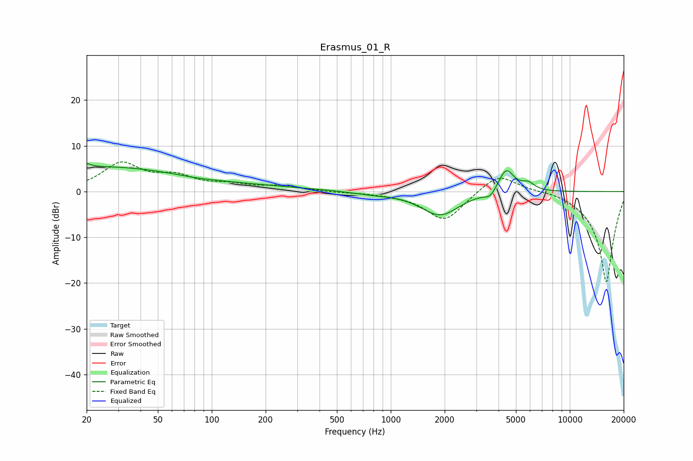

# Erasmus_01_R
See [usage instructions](https://github.com/jaakkopasanen/AutoEq#usage) for more options and info.

### Parametric EQs
Apply preamp of -6.2 dB when using parametric equalizer.

|   # | Type    |   Fc (Hz) |    Q |   Gain (dB) |
|-----|---------|-----------|------|-------------|
|   1 | Peaking |        20 | 0.28 |         4.5 |
|   2 | Peaking |        20 | 6    |        -3.4 |
|   3 | Peaking |        20 | 5.98 |         4.2 |
|   4 | Peaking |        74 | 0.21 |         1.3 |
|   5 | Peaking |        83 | 1.26 |        -0.3 |
|   6 | Peaking |       767 | 1.26 |        -0.5 |
|   7 | Peaking |      1884 | 1.33 |        -5.2 |
|   8 | Peaking |      3599 | 4.46 |        -1.6 |
|   9 | Peaking |      4409 | 3.14 |         5.3 |
|  10 | Peaking |      5857 | 4.01 |         1.5 |

### Fixed Band EQs
When using fixed band (also called graphic) equalizer, apply preamp of **-6.6 dB** (if available) and set gains manually with these parameters.

|   # | Type    |   Fc (Hz) |    Q |   Gain (dB) |
|-----|---------|-----------|------|-------------|
|   1 | Peaking |        31 | 1.41 |         5.9 |
|   2 | Peaking |        62 | 1.41 |         2.8 |
|   3 | Peaking |       125 | 1.41 |         1.2 |
|   4 | Peaking |       250 | 1.41 |         1.1 |
|   5 | Peaking |       500 | 1.41 |        -0.2 |
|   6 | Peaking |      1000 | 1.41 |        -0.3 |
|   7 | Peaking |      2000 | 1.41 |        -6.5 |
|   8 | Peaking |      4000 | 1.41 |         4.3 |
|   9 | Peaking |      8000 | 1.41 |         0.6 |
|  10 | Peaking |     16000 | 1.41 |       -20   |

### Graphs

