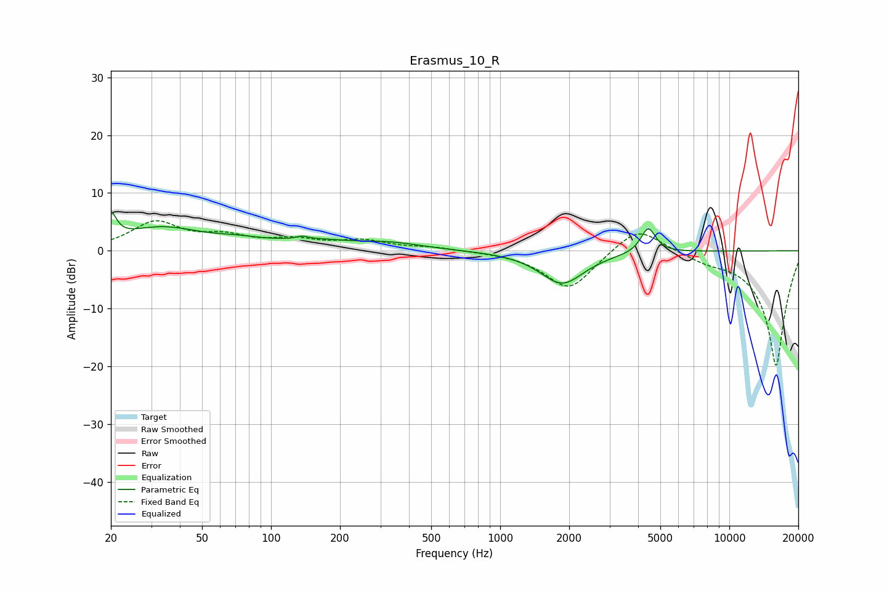

# Erasmus_10_R
See [usage instructions](https://github.com/jaakkopasanen/AutoEq#usage) for more options and info.

### Parametric EQs
Apply preamp of -6.7 dB when using parametric equalizer.

|   # | Type    |   Fc (Hz) |    Q |   Gain (dB) |
|-----|---------|-----------|------|-------------|
|   1 | Peaking |        20 | 5.83 |         4.4 |
|   2 | Peaking |        33 | 0.81 |         3.8 |
|   3 | Peaking |        72 | 1.26 |         0.9 |
|   4 | Peaking |       137 | 6    |         2.3 |
|   5 | Peaking |       137 | 6    |        -1.8 |
|   6 | Peaking |       180 | 0.71 |         1.8 |
|   7 | Peaking |       215 | 1.22 |        -0.5 |
|   8 | Peaking |       345 | 1.09 |         0.8 |
|   9 | Peaking |      1865 | 1.47 |        -5.7 |
|  10 | Peaking |      4425 | 4.42 |         4.4 |

### Fixed Band EQs
When using fixed band (also called graphic) equalizer, apply preamp of **-5.3 dB** (if available) and set gains manually with these parameters.

|   # | Type    |   Fc (Hz) |    Q |   Gain (dB) |
|-----|---------|-----------|------|-------------|
|   1 | Peaking |        31 | 1.41 |         4.7 |
|   2 | Peaking |        62 | 1.41 |         2   |
|   3 | Peaking |       125 | 1.41 |         1.6 |
|   4 | Peaking |       250 | 1.41 |         1.6 |
|   5 | Peaking |       500 | 1.41 |         0.5 |
|   6 | Peaking |      1000 | 1.41 |        -0.1 |
|   7 | Peaking |      2000 | 1.41 |        -6.8 |
|   8 | Peaking |      4000 | 1.41 |         4.7 |
|   9 | Peaking |      8000 | 1.41 |        -1.2 |
|  10 | Peaking |     16000 | 1.41 |       -20   |

### Graphs

