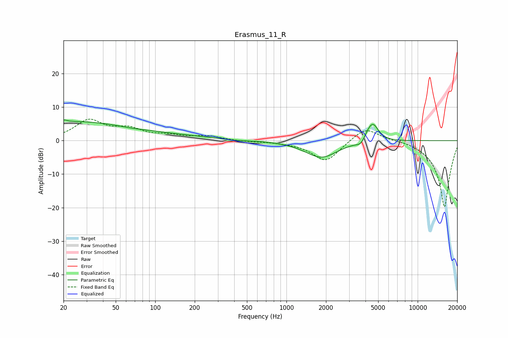

# Erasmus_11_R
See [usage instructions](https://github.com/jaakkopasanen/AutoEq#usage) for more options and info.

### Parametric EQs
Apply preamp of -6.3 dB when using parametric equalizer.

|   # | Type    |   Fc (Hz) |    Q |   Gain (dB) |
|-----|---------|-----------|------|-------------|
|   1 | Peaking |        20 | 6    |         4.1 |
|   2 | Peaking |        20 | 6    |        -3.5 |
|   3 | Peaking |        22 | 0.29 |         4.6 |
|   4 | Peaking |        65 | 0.18 |         1.3 |
|   5 | Peaking |        65 | 1.32 |        -0.3 |
|   6 | Peaking |       409 | 1.25 |        -0.4 |
|   7 | Peaking |      1842 | 1.15 |        -5.1 |
|   8 | Peaking |      3708 | 4.11 |        -1.8 |
|   9 | Peaking |      4131 | 3.86 |         1.4 |
|  10 | Peaking |      4565 | 3.29 |         5.2 |

### Fixed Band EQs
When using fixed band (also called graphic) equalizer, apply preamp of **-6.5 dB** (if available) and set gains manually with these parameters.

|   # | Type    |   Fc (Hz) |    Q |   Gain (dB) |
|-----|---------|-----------|------|-------------|
|   1 | Peaking |        31 | 1.41 |         5.8 |
|   2 | Peaking |        62 | 1.41 |         3   |
|   3 | Peaking |       125 | 1.41 |         1.2 |
|   4 | Peaking |       250 | 1.41 |         1.2 |
|   5 | Peaking |       500 | 1.41 |        -0.3 |
|   6 | Peaking |      1000 | 1.41 |        -0.3 |
|   7 | Peaking |      2000 | 1.41 |        -6.3 |
|   8 | Peaking |      4000 | 1.41 |         4.4 |
|   9 | Peaking |      8000 | 1.41 |         0.4 |
|  10 | Peaking |     16000 | 1.41 |       -20   |

### Graphs

