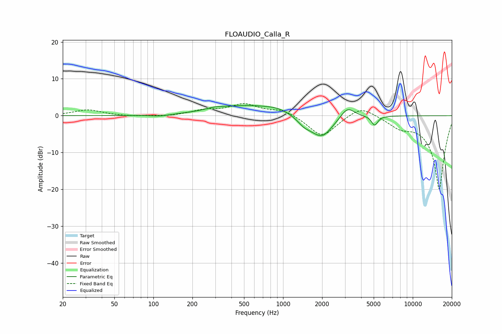

# FLOAUDIO_Calla_R
See [usage instructions](https://github.com/jaakkopasanen/AutoEq#usage) for more options and info.

### Parametric EQs
Apply preamp of -2.9 dB when using parametric equalizer.

|   # | Type    |   Fc (Hz) |    Q |   Gain (dB) |
|-----|---------|-----------|------|-------------|
|   1 | Peaking |       113 | 1.96 |        -0.5 |
|   2 | Peaking |       298 | 2.08 |         0.6 |
|   3 | Peaking |       552 | 0.53 |         2.8 |
|   4 | Peaking |       926 | 1.62 |         0.8 |
|   5 | Peaking |      1437 | 3.01 |        -1   |
|   6 | Peaking |      1458 | 2.87 |        -0.4 |
|   7 | Peaking |      1944 | 1.45 |        -5.9 |
|   8 | Peaking |      2076 | 3.47 |        -0.5 |
|   9 | Peaking |      3133 | 2.56 |         3.3 |
|  10 | Peaking |      5085 | 5.95 |        -2.6 |

### Fixed Band EQs
When using fixed band (also called graphic) equalizer, apply preamp of **-3.4 dB** (if available) and set gains manually with these parameters.

|   # | Type    |   Fc (Hz) |    Q |   Gain (dB) |
|-----|---------|-----------|------|-------------|
|   1 | Peaking |        31 | 1.41 |         1.6 |
|   2 | Peaking |        62 | 1.41 |        -0.2 |
|   3 | Peaking |       125 | 1.41 |        -0.2 |
|   4 | Peaking |       250 | 1.41 |         1.3 |
|   5 | Peaking |       500 | 1.41 |         2.9 |
|   6 | Peaking |      1000 | 1.41 |         1.7 |
|   7 | Peaking |      2000 | 1.41 |        -5.9 |
|   8 | Peaking |      4000 | 1.41 |         3.1 |
|   9 | Peaking |      8000 | 1.41 |        -2.4 |
|  10 | Peaking |     16000 | 1.41 |       -20   |

### Graphs

